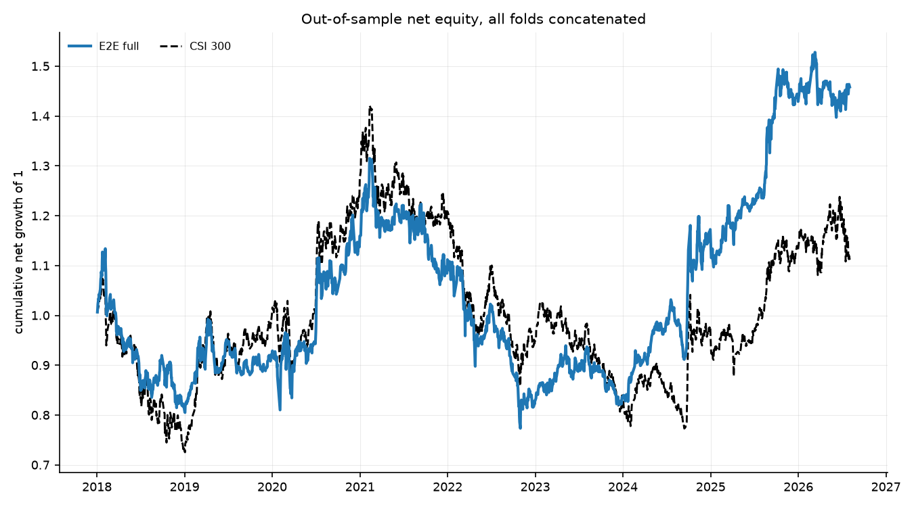
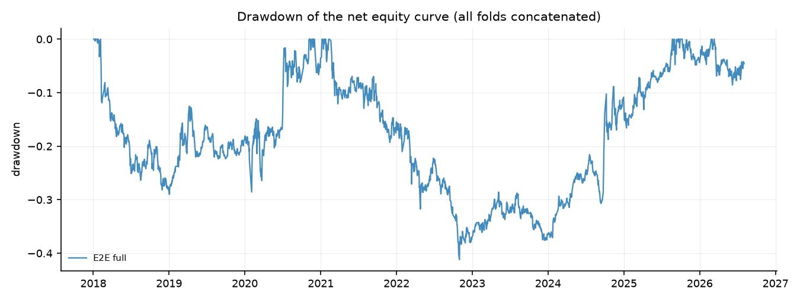
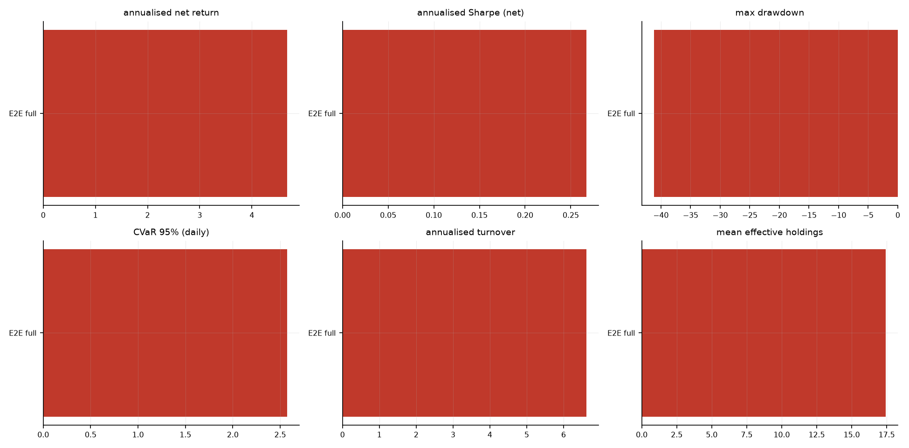
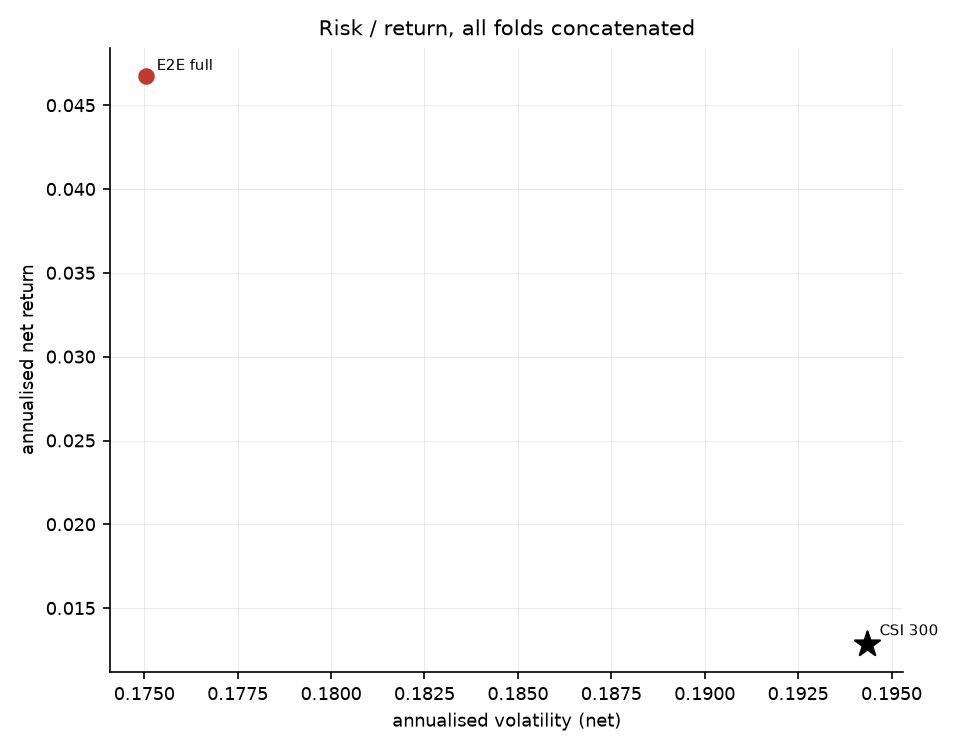
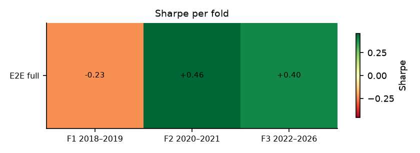
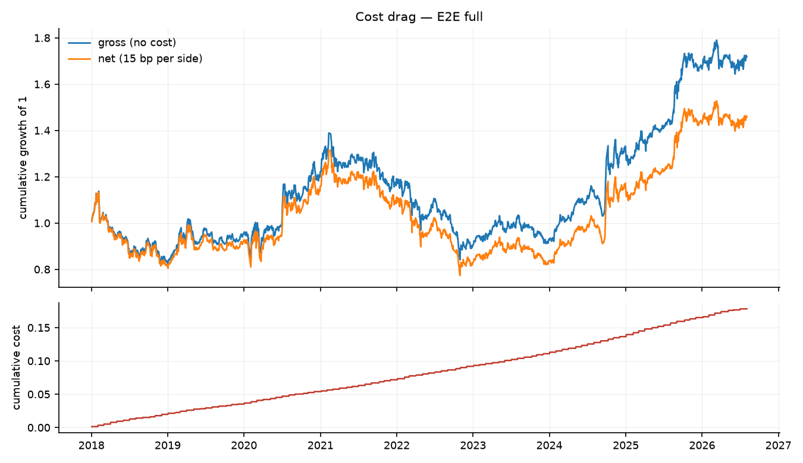
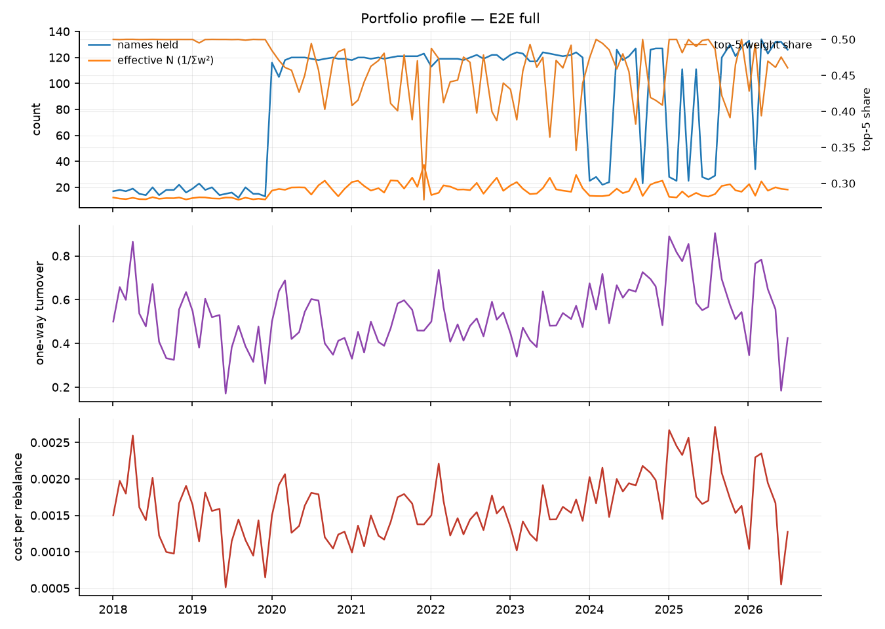

# 端到端可微 Mean-CVaR 投资组合学习 — 实验结果报告

- 运行目录：`csi300_extra_returns`
- 运行耗时：17.6 分钟，作业 3/3 成功
- 样本：沪深 300 动态成分股，测试窗口 3 折拼接，VaR/CVaR 置信水平 95%
- 成本假设：单边 15.00 bp，线性；换手率按单边（½·Σ|Δw|）统计，并按实际调仓频率年化

## 0. 折划分

| 折 | 训练起 | 训练止 | 验证起 | 验证止 | 测试起 | 测试止 |
|---|---|---|---|---|---|---|
| f1_2018_2019 | 2010-01-01 | 2016-12-31 | 2017-01-01 | 2017-12-31 | 2018-01-01 | 2019-12-31 |
| f2_2020_2021 | 2010-01-01 | 2018-12-31 | 2019-01-01 | 2019-12-31 | 2020-01-01 | 2021-12-31 |
| f3_2022_2026 | 2010-01-01 | 2020-12-31 | 2021-01-01 | 2021-12-31 | 2022-01-01 | 2026-12-31 |

## 1. 主结果（所有折的样本外日收益拼接后重算）

| 实验 | 类别 | 年化净收益 | 年化波动 | Sharpe | 最大回撤 | CVaR95(日) | 年化换手 | 有效持仓 | 成本拖累 |
|---|---|---|---|---|---|---|---|---|---|
| full | e2e | 4.67% | 17.51% | 0.27 | -41.19% | 2.57% | 6.62 | 17.42 | 2.10% |

### 1.2 持仓数量与集中度（Plan §6 要求项）

逐次调仓统计后取均值；HHI = Σw²，Top-5 与最大权重为占组合比例。

| 实验 | 类别 | 持仓数(>1e-3) | 有效持仓 1/Σw² | HHI Σw² | 前5大权重 | 最大单一权重 |
|---|---|---|---|---|---|---|
| full | e2e | 85.85 | 17.42 | 0.06 | 46.23% | 10.00% |

## 2. 分折结果

### 2.1 Sharpe

| 实验 | 折 | Sharpe | 年化净收益 | 最大回撤 | CVaR95(日) |
|---|---|---|---|---|---|
| full | f1_2018_2019 | -0.23 | -3.75% | -29.01% | 2.60% |
| full | f2_2020_2021 | 0.46 | 9.62% | -19.28% | 3.02% |
| full | f3_2022_2026 | 0.40 | 6.43% | -30.19% | 2.24% |

## 3. 选择层诊断

| 实验 | 折 | 选择器 | 编码器哈希 | 期数 | 可投资 | logit 极差 | 稀疏临界 1/n | 极差<1/n 占比 | π 支撑集 | π 有效数 | 账本持仓 | 账本有效持仓 |
|---|---|---|---|---|---|---|---|---|---|---|---|---|
| full | f1_2018_2019 | sparsemax | 495d7f55842e6560 | 24 | 116.58 | 5.87e-02 | 8.58e-03 | 0.00% | 32.21 | 23.28 | 17.00 | 11.51 |
| full | f2_2020_2021 | sparsemax | c670931cd6975976 | 24 | 118.75 | 1.47e-01 | 8.42e-03 | 0.00% | 9.50 | 6.65 | 119.00 | 20.93 |
| full | f3_2022_2026 | sparsemax | 0c0fbe300c5245ad | 55 | 118.93 | 1.89e-01 | 8.41e-03 | 0.00% | 13.53 | 8.51 | 101.44 | 18.47 |

> 诊断口径：重放测试期并只跑编码器（`run_layer=False`），以空账本（`prev = 0`）隔离选择层本身；`book_*` 列读自回测写出的 `weights.csv`，因此与 `pi_*` 的差别来自不可卖出持仓的结转与优化层。

## 4. 结论

1. **整体排序**：在全部 3 折测试窗口拼接后的样本上，夏普比率最高的是 `full`（Sharpe 0.27，年化净收益 4.67%，最大回撤 -41.19%）。基准（等权 1/N）的年化净收益为 n/a，传统历史情景 Mean-CVaR 为 n/a。
6. **风险与成本**：`full` 的日 CVaR(95%) 为 2.57%，年化波动 17.51%，平均持仓 85.9 只、有效持仓 17.4 只，年化单边换手 6.62，成本拖累（毛收益−净收益）2.10%。
7. **跨折稳定性**：没有任何实验在全部 3 折上都取得正夏普；正夏普折数最多的是 `full`（2/3 折，最差 -0.23 / 最好 +0.46）。所有策略在不同年份区间上都有明显波动，单折结论不足以支撑泛化性判断。
8. **解读与局限**：结论受限于（a）单一指数（沪深 300 动态成分股）与单一成本假设（单边 15 bp 线性成本，未建模冲击成本与涨跌停延迟成交）；（b）测试窗口只有 3 折、共约 8 年，统计功效有限；（c）场景生成是高斯参数化模型，CVaR 只对模型隐含分布稳健；（d）深度网络的随机性使同一配置重复训练仍会有数个百分点差异，报告中的差异若小于该量级不应视为真实效应；（e）资产槽位数 `n_max` 由每折的可投资域决定（f1/f2/f3 = 154/155/165），它通过 `Dropout` 的随机数消耗量影响训练轨迹，因此**跨折的绝对值不可直接横向比较**（仓库内同一折的所有实验共用同一个 `n_max`，折内比较仍然成立）；（f）选择层的稀疏不等于组合稀疏——单票 10% 上限会把权重摊到更多票上，有效持仓应看回测输出的 `eff_holdings`（`full` 为 17.4 只），而不是 π 的支撑集大小。

## 5. 图表
















## 6. 复现

```bash
python scripts/01_prepare_data.py --validate
python scripts/02_run_experiments.py --config results/csi300_extra_returns/config.yaml --workers 4
python scripts/04_selection_diagnostics.py --run results/csi300_extra_returns
python scripts/03_report.py --run results/csi300_extra_returns
```

> 每次运行都会把**解析后的完整配置**复制到运行目录的 `config.yaml`，因此上面第二条命令对基线网格（`configs/csi300.yaml`）、固定分数规则网格（`configs/csi300_score_rule.yaml`）和全样本扩展网格（`configs/csi300_full_universe.yaml`）都成立。
