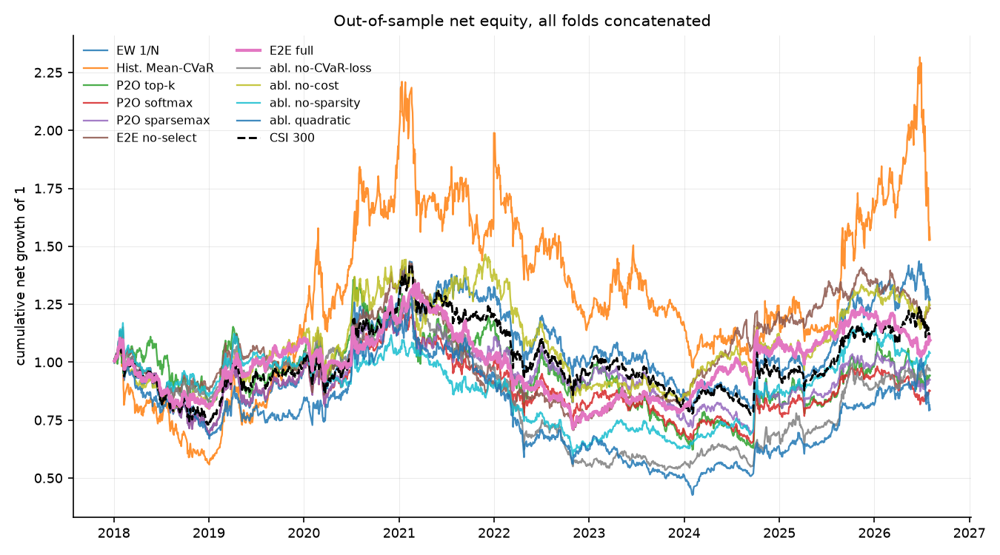
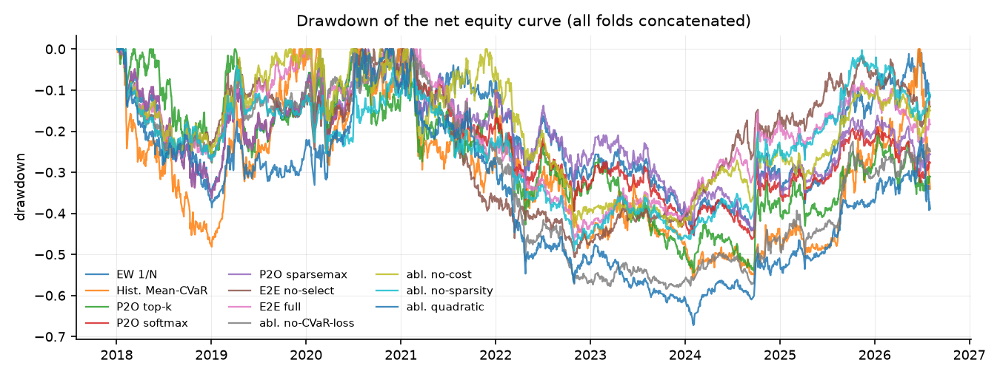
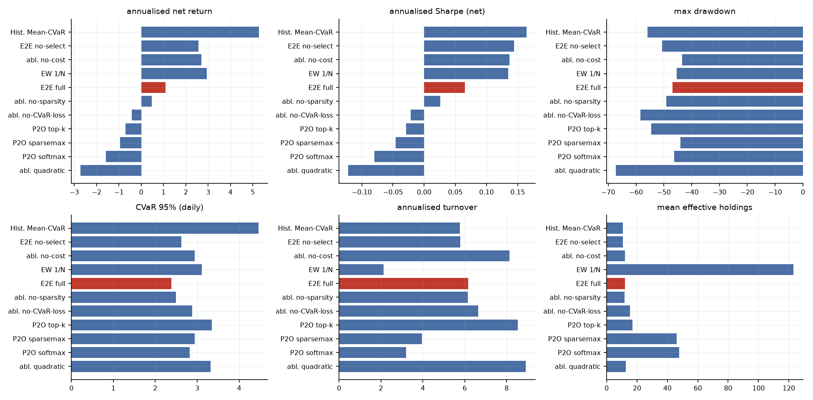
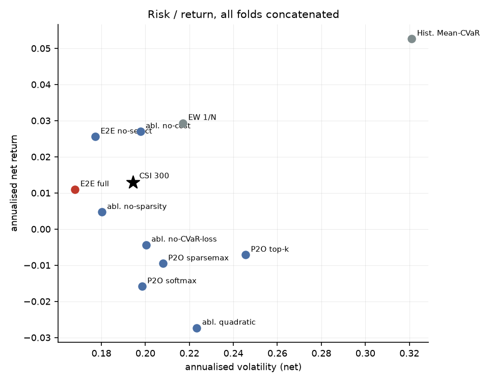
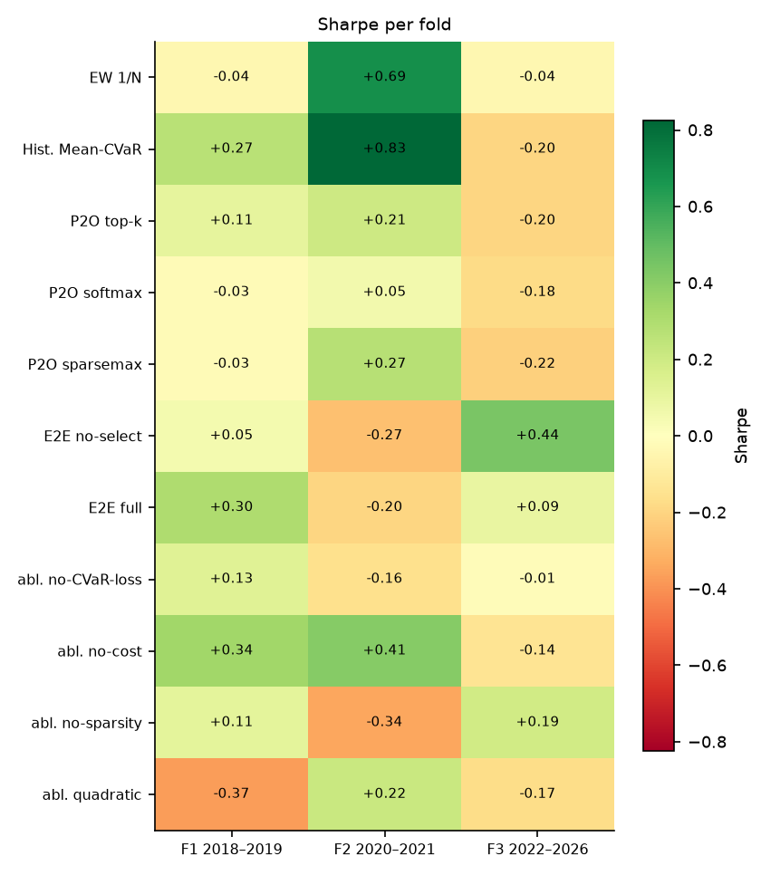
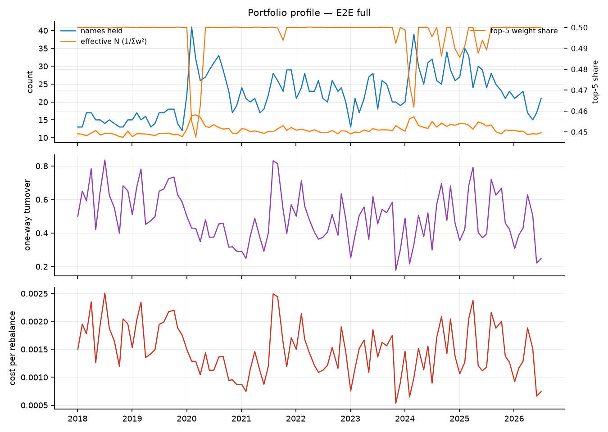

# 端到端可微 Mean-CVaR 投资组合学习 — 实验结果报告

- 运行目录：`csi300_20260910_235309`
- 运行耗时：52.4 分钟，作业 33/33 成功
- 样本：沪深 300 动态成分股，测试窗口 3 折拼接，VaR/CVaR 置信水平 95%
- 成本假设：单边 15.00 bp，线性；换手率按单边（½·Σ|Δw|）统计，并按实际调仓频率年化

## 0. 折划分

| 折 | 训练起 | 训练止 | 验证起 | 验证止 | 测试起 | 测试止 |
|---|---|---|---|---|---|---|
| f1_2018_2019 | 2010-01-01 | 2016-12-31 | 2017-01-01 | 2017-12-31 | 2018-01-01 | 2019-12-31 |
| f2_2020_2021 | 2010-01-01 | 2018-12-31 | 2019-01-01 | 2019-12-31 | 2020-01-01 | 2021-12-31 |
| f3_2022_2026 | 2010-01-01 | 2020-12-31 | 2021-01-01 | 2021-12-31 | 2022-01-01 | 2026-12-31 |

## 1. 主结果（所有折的样本外日收益拼接后重算）

| 实验 | 类别 | 年化净收益 | 年化波动 | Sharpe | 最大回撤 | CVaR95(日) | 年化换手 | 有效持仓 | 成本拖累 |
|---|---|---|---|---|---|---|---|---|---|
| meancvar_hist | baseline | 5.27% | 32.11% | 0.16 | -55.83% | 4.46% | 5.77 | 10.57 | 1.84% |
| e2e_noselect | e2e | 2.56% | 17.72% | 0.14 | -50.62% | 2.63% | 5.80 | 10.72 | 1.80% |
| full_nocost | ablation | 2.70% | 19.77% | 0.14 | -43.43% | 2.94% | 8.14 | 11.98 | 2.54% |
| ew | baseline | 2.94% | 21.71% | 0.14 | -45.38% | 3.11% | 2.13 | 123.11 | 0.66% |
| full | e2e | 1.10% | 16.80% | 0.07 | -46.82% | 2.38% | 6.16 | 12.20 | 1.88% |
| full_nosparse | ablation | 0.47% | 18.02% | 0.03 | -49.09% | 2.50% | 6.14 | 11.76 | 1.87% |
| full_nocvar_loss | ablation | -0.43% | 20.03% | -0.02 | -58.36% | 2.88% | 6.65 | 15.22 | 2.01% |
| lstm_topk | main | -0.71% | 24.55% | -0.03 | -54.47% | 3.35% | 8.53 | 16.99 | 2.58% |
| lstm_sparsemax | main | -0.95% | 20.80% | -0.05 | -44.08% | 2.94% | 3.96 | 46.21 | 1.19% |
| lstm_softmax | main | -1.58% | 19.85% | -0.08 | -46.25% | 2.82% | 3.20 | 47.66 | 0.95% |
| full_quad | ablation | -2.73% | 22.34% | -0.12 | -67.20% | 3.31% | 8.92 | 12.74 | 2.64% |

### 1.2 持仓数量与集中度（Plan §6 要求项）

逐次调仓统计后取均值；HHI = Σw²，Top-5 与最大权重为占组合比例。

| 实验 | 类别 | 持仓数(>1e-3) | 有效持仓 1/Σw² | HHI Σw² | 前5大权重 | 最大单一权重 |
|---|---|---|---|---|---|---|
| meancvar_hist | baseline | 13.11 | 10.57 | 0.09 | 50.96% | 10.94% |
| e2e_noselect | e2e | 14.10 | 10.72 | 0.09 | 50.00% | 10.00% |
| full_nocost | ablation | 25.26 | 11.98 | 0.08 | 49.64% | 10.01% |
| ew | baseline | 123.39 | 123.11 | 0.01 | 4.43% | 1.02% |
| full | e2e | 22.39 | 12.20 | 0.08 | 49.71% | 10.00% |
| full_nosparse | ablation | 19.34 | 11.76 | 0.09 | 49.83% | 10.00% |
| full_nocvar_loss | ablation | 30.94 | 15.22 | 0.08 | 46.36% | 10.12% |
| lstm_topk | main | 27.58 | 16.99 | 0.06 | 43.65% | 9.78% |
| lstm_sparsemax | main | 91.53 | 46.21 | 0.03 | 25.74% | 7.19% |
| lstm_softmax | main | 93.43 | 47.66 | 0.03 | 24.80% | 7.06% |
| full_quad | ablation | 16.13 | 12.74 | 0.08 | 47.40% | 9.96% |

## 2. 分折结果

### 2.1 Sharpe

| 实验 | 折 | Sharpe | 年化净收益 | 最大回撤 | CVaR95(日) |
|---|---|---|---|---|---|
| e2e_noselect | f1_2018_2019 | 0.05 | 0.91% | -27.27% | 2.72% |
| e2e_noselect | f2_2020_2021 | -0.27 | -5.50% | -39.37% | 3.00% |
| e2e_noselect | f3_2022_2026 | 0.44 | 7.07% | -22.50% | 2.35% |
| ew | f1_2018_2019 | -0.04 | -0.92% | -35.69% | 3.19% |
| ew | f2_2020_2021 | 0.69 | 16.47% | -17.88% | 3.61% |
| ew | f3_2022_2026 | -0.04 | -0.85% | -39.51% | 2.81% |
| full | f1_2018_2019 | 0.30 | 5.33% | -27.44% | 2.60% |
| full | f2_2020_2021 | -0.20 | -3.69% | -26.11% | 2.57% |
| full | f3_2022_2026 | 0.09 | 1.43% | -31.65% | 2.13% |
| full_nocost | f1_2018_2019 | 0.34 | 6.46% | -26.17% | 2.73% |
| full_nocost | f2_2020_2021 | 0.41 | 10.89% | -22.94% | 4.06% |
| full_nocost | f3_2022_2026 | -0.14 | -2.25% | -39.88% | 2.27% |
| full_nocvar_loss | f1_2018_2019 | 0.13 | 2.33% | -27.51% | 2.57% |
| full_nocvar_loss | f2_2020_2021 | -0.16 | -3.43% | -27.77% | 2.97% |
| full_nocvar_loss | f3_2022_2026 | -0.01 | -0.29% | -43.52% | 2.95% |
| full_nosparse | f1_2018_2019 | 0.11 | 1.93% | -27.22% | 2.54% |
| full_nosparse | f2_2020_2021 | -0.34 | -7.03% | -24.21% | 2.78% |
| full_nosparse | f3_2022_2026 | 0.19 | 3.29% | -36.01% | 2.32% |
| full_quad | f1_2018_2019 | -0.37 | -8.17% | -38.55% | 3.40% |
| full_quad | f2_2020_2021 | 0.22 | 5.26% | -30.25% | 3.50% |
| full_quad | f3_2022_2026 | -0.17 | -3.63% | -52.96% | 3.14% |
| lstm_softmax | f1_2018_2019 | -0.03 | -0.58% | -36.35% | 3.17% |
| lstm_softmax | f2_2020_2021 | 0.05 | 1.12% | -23.56% | 3.06% |
| lstm_softmax | f3_2022_2026 | -0.18 | -3.18% | -35.44% | 2.43% |
| lstm_sparsemax | f1_2018_2019 | -0.03 | -0.58% | -36.35% | 3.17% |
| lstm_sparsemax | f2_2020_2021 | 0.27 | 6.25% | -19.93% | 3.40% |
| lstm_sparsemax | f3_2022_2026 | -0.22 | -4.11% | -37.38% | 2.54% |
| lstm_topk | f1_2018_2019 | 0.11 | 2.57% | -27.69% | 3.29% |
| lstm_topk | f2_2020_2021 | 0.21 | 5.51% | -27.45% | 4.02% |
| lstm_topk | f3_2022_2026 | -0.20 | -4.70% | -45.47% | 3.02% |
| meancvar_hist | f1_2018_2019 | 0.27 | 8.54% | -48.11% | 4.38% |
| meancvar_hist | f2_2020_2021 | 0.83 | 31.55% | -34.93% | 4.97% |
| meancvar_hist | f3_2022_2026 | -0.20 | -5.81% | -49.04% | 4.19% |

## 3. 选择层诊断

1. **三个预测-再优化实验训练的是同一个网络**：`lstm_topk` / `lstm_softmax` / `lstm_sparsemax` 的编码器参数 SHA-256 完全相同（因为该范式的训练损失只保留预测项 `l_pred = 1`，选择层只在组合形成阶段起作用）。三者在样本外的差异 100% 来自选择层（支撑集与仓位上限），不包含任何训练随机性，因而是干净的对照。

2. **在预测-再优化范式下 sparsemax 几乎不稀疏**：稀疏的临界值是 `max(z) − z_i > 1 / n`（可投资域约 118 只，即阈值约 8.45e-03），而冻结编码器输出的 logit 极差平均只有 9.89e-03，与阈值同量级；各折「极差 < 1/n」的期数占比为 f1 100%、f2 4%、f3 2%（三折加权 25%）。结果是 sparsemax 的平均支撑集 113 只，与 softmax 的 118 只几乎一致，它退化成了（近似）softmax。**要真正得到稀疏组合，要么显式给定支撑集大小（top-k），要么让选择层参与训练、把 logit 尺度抬到 `1/n` 以上。**

3. **在该范式下只有 top-k 是真正稀疏的选择器**：支撑集恒为 25 只（等于配置的 `topk = 25`），实际账本平均持有 27.6 只、有效持仓 17.0 只（单票 10% 上限把权重摊薄，所以有效持仓明显少于名义持仓）；相比之下 softmax / sparsemax 的账本摊到 92 只左右。

4. **决定稀疏性的是损失函数，而不是选择层本身**：同一个 sparsemax 层，在 `full`（端到端、损失里带 `l_sparse`）里 logit 极差被训练到 4.38e-02，是阈值 8.45e-03 的 5.2 倍，**没有任何一期退化**（`极差 < 1/n` 占比 0%），π 的支撑集收缩到 48 只、账本收缩到 22.4 只；而在 `lstm_sparsemax` 里同样的层几乎不删任何票（支撑集 113 只、账本 91.5 只）。也就是说，稀疏选择是 `L_sparse` 这个损失项学出来的行为，选择层只负责把学好的 logit 变成合法的组合权重。

| 实验 | 折 | 选择器 | 编码器哈希 | 期数 | 可投资 | logit 极差 | 稀疏临界 1/n | 极差<1/n 占比 | π 支撑集 | π 有效数 | 账本持仓 | 账本有效持仓 |
|---|---|---|---|---|---|---|---|---|---|---|---|---|
| full | f1_2018_2019 | sparsemax | 6c62cd2651494db1 | 24 | 116.58 | 5.99e-02 | 8.58e-03 | 0.00% | 28.04 | 19.16 | 15.00 | 10.97 |
| full | f2_2020_2021 | sparsemax | 0e99f4391cfe02e5 | 24 | 118.75 | 2.82e-02 | 8.42e-03 | 0.00% | 58.25 | 39.28 | 25.29 | 12.75 |
| full | f3_2022_2026 | sparsemax | d9cdcf430fa5dd7e | 55 | 118.93 | 4.36e-02 | 8.41e-03 | 0.00% | 53.15 | 39.62 | 24.35 | 12.49 |
| lstm_softmax | f1_2018_2019 | softmax | f55fef77012c64d9 | 24 | 116.58 | 1.13e-03 | 8.58e-03 | 100.00% | 116.58 | 116.58 | 120.50 | 92.97 |
| lstm_softmax | f2_2020_2021 | softmax | e87008f9e91f6626 | 24 | 118.75 | 1.34e-02 | 8.42e-03 | 4.17% | 118.75 | 118.75 | 71.25 | 33.56 |
| lstm_softmax | f3_2022_2026 | softmax | e3b5a807c05b56a3 | 55 | 118.93 | 1.22e-02 | 8.41e-03 | 1.82% | 118.93 | 118.93 | 91.29 | 34.05 |
| lstm_sparsemax | f1_2018_2019 | sparsemax | f55fef77012c64d9 | 24 | 116.58 | 1.13e-03 | 8.58e-03 | 100.00% | 116.58 | 116.16 | 120.50 | 92.97 |
| lstm_sparsemax | f2_2020_2021 | sparsemax | e87008f9e91f6626 | 24 | 118.75 | 1.34e-02 | 8.42e-03 | 4.17% | 112.54 | 106.92 | 73.54 | 32.25 |
| lstm_sparsemax | f3_2022_2026 | sparsemax | e3b5a807c05b56a3 | 55 | 118.93 | 1.22e-02 | 8.41e-03 | 1.82% | 111.35 | 101.81 | 86.75 | 31.90 |
| lstm_topk | f1_2018_2019 | topk | f55fef77012c64d9 | 24 | 116.58 | 1.13e-03 | 8.58e-03 | 100.00% | 25.00 | 25.00 | 26.62 | 21.09 |
| lstm_topk | f2_2020_2021 | topk | e87008f9e91f6626 | 24 | 118.75 | 1.34e-02 | 8.42e-03 | 4.17% | 25.00 | 25.00 | 25.46 | 15.38 |
| lstm_topk | f3_2022_2026 | topk | e3b5a807c05b56a3 | 55 | 118.93 | 1.22e-02 | 8.41e-03 | 1.82% | 25.00 | 25.00 | 28.93 | 15.90 |

> 诊断口径：重放测试期并只跑编码器（`run_layer=False`），以空账本（`prev = 0`）隔离选择层本身；`book_*` 列读自回测写出的 `weights.csv`，因此与 `pi_*` 的差别来自不可卖出持仓的结转与优化层。

## 4. 结论

1. **整体排序**：在全部 3 折测试窗口拼接后的样本上，夏普比率最高的是 `meancvar_hist`（Sharpe 0.16，年化净收益 5.27%，最大回撤 -55.83%）。基准（等权 1/N）的年化净收益为 2.94%，传统历史情景 Mean-CVaR 为 5.27%。
2. **端到端 vs 预测-再优化**：`full`（端到端可微，Sharpe 0.07，年化 1.10%, 最大回撤 -46.82%）优于对应的预测-再优化版本 `lstm_sparsemax`（Sharpe -0.05，年化 -0.95%，最大回撤 -44.08%）。Sharpe 差 +0.11，最大回撤差 -2.74 个百分点。两者的换手率分别为 6.16 和 3.96（年化，单边）。
3. **选择层对比（三者训练完全相同，只差选择层）**：`lstm_topk` Sharpe -0.03、有效持仓 17.0；`lstm_softmax` Sharpe -0.08、有效持仓 47.7；`lstm_sparsemax` Sharpe -0.05、有效持仓 46.2。三者编码器参数逐位相同（见 §3 诊断），因此差异完全由选择层决定：`lstm_topk` 名义上最优（Sharpe -0.03），但三者 Sharpe 的极差只有 0.05，落在本设置的重训噪声量级内，**因此这不构成一个稳健的排序**。`lstm_softmax` 与 `lstm_sparsemax` 的净值曲线几乎重合，原因是 logit 极差与稀疏临界值 `1/n` 同量级（f1 折甚至全程低于阈值），sparsemax 退化为（近似）softmax，几乎不删任何票（详见 §3）。
4. **消融（相对 `full`，正数表示变好）**：
   - 去掉决策损失中的尾部（CVaR）项（`full_nocvar_loss`）：Sharpe -0.02（-0.09），年化净收益 -0.43%（-1.53 个百分点），最大回撤 -58.36%（-11.54 个百分点），年化换手 6.65（+0.49）
   - 训练与优化都不看交易成本（`full_nocost`）：Sharpe 0.14（+0.07），年化净收益 2.70%（+1.60 个百分点），最大回撤 -43.43%（+3.39 个百分点），年化换手 8.14（+1.98）
   - 去掉稀疏选择激励（`full_nosparse`）：Sharpe 0.03（-0.04），年化净收益 0.47%（-0.63 个百分点），最大回撤 -49.09%（-2.27 个百分点），年化换手 6.14（-0.02）
   - 用二次（Herfindahl）分散项替代熵正则（`full_quad`）：Sharpe -0.12（-0.19），年化净收益 -2.73%（-3.83 个百分点），最大回撤 -67.20%（-20.38 个百分点），年化换手 8.92（+2.77）
5. **相对等权基线的真实超额**：`full` 年化净收益 1.10%，等权 2.94%；信息比率 -0.05，alpha 0.44%，beta 0.65。最大回撤从 -45.38% 扩大到 -46.82%。
6. **风险与成本**：`full` 的日 CVaR(95%) 为 2.38%，年化波动 16.80%，平均持仓 22.4 只、有效持仓 12.2 只，年化单边换手 6.16，成本拖累（毛收益−净收益）1.88%。
7. **跨折稳定性**：没有任何实验在全部 3 折上都取得正夏普；正夏普折数最多的是 `full_nocost`（2/3 折，最差 -0.14 / 最好 +0.41）。所有策略在不同年份区间上都有明显波动，单折结论不足以支撑泛化性判断。
8. **解读与局限**：结论受限于（a）单一指数（沪深 300 动态成分股）与单一成本假设（单边 15 bp 线性成本，未建模冲击成本与涨跌停延迟成交）；（b）测试窗口只有 3 折、共约 8 年，统计功效有限；（c）场景生成是高斯参数化模型，CVaR 只对模型隐含分布稳健；（d）深度网络的随机性使同一配置重复训练仍会有数个百分点差异，报告中的差异若小于该量级不应视为真实效应；（e）资产槽位数 `n_max` 由每折的可投资域决定（f1/f2/f3 = 154/155/165），它通过 `Dropout` 的随机数消耗量影响训练轨迹，因此**跨折的绝对值不可直接横向比较**（仓库内同一折的所有实验共用同一个 `n_max`，折内比较仍然成立）；（f）选择层的稀疏不等于组合稀疏——单票 10% 上限会把权重摊到更多票上，有效持仓应看回测输出的 `eff_holdings`（`full` 为 12.2 只），而不是 π 的支撑集大小。

## 5. 图表














## 6. 复现

```bash
python scripts/01_prepare_data.py --validate
python scripts/02_run_experiments.py --config results/csi300_20260910_235309/config.yaml --workers 4
python scripts/04_selection_diagnostics.py --run results/csi300_20260910_235309
python scripts/03_report.py --run results/csi300_20260910_235309
```

> 每次运行都会把**解析后的完整配置**复制到运行目录的 `config.yaml`，因此上面第二条命令对基线网格（`configs/csi300.yaml`）、固定分数规则网格（`configs/csi300_score_rule.yaml`）和全样本扩展网格（`configs/csi300_full_universe.yaml`）都成立。
