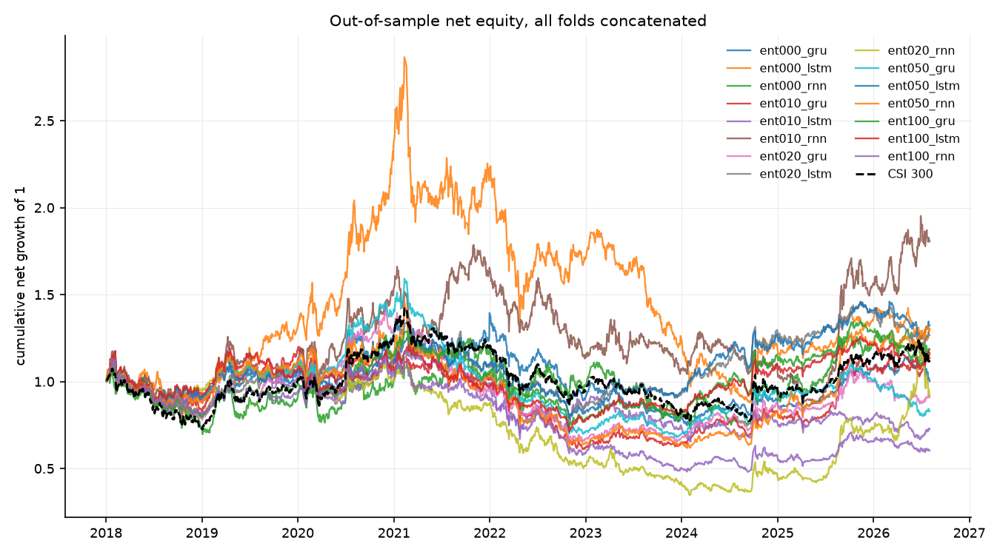
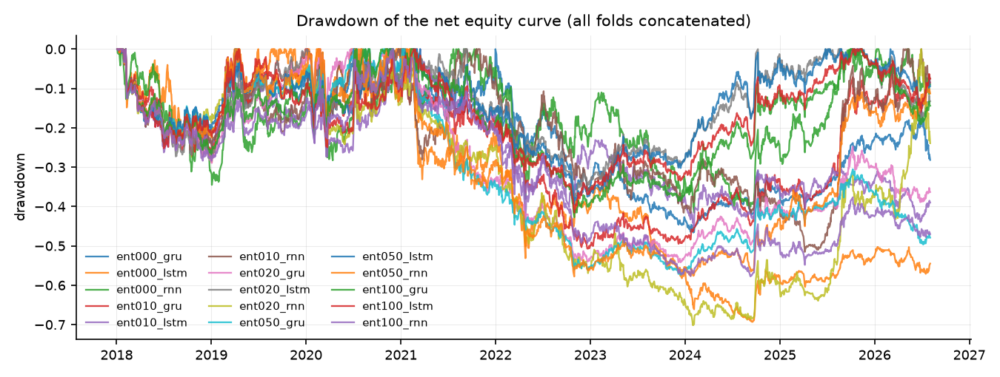
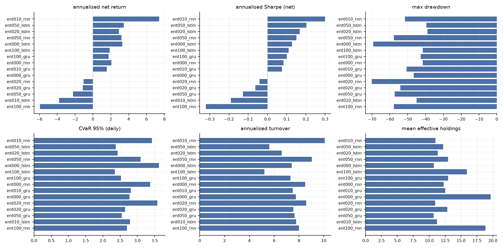
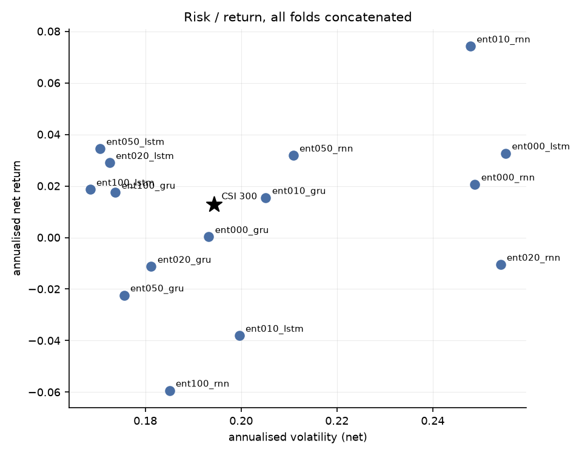
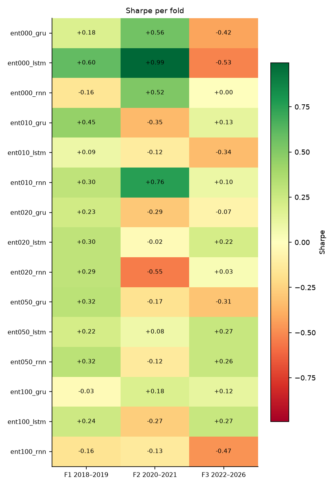

# 端到端可微 Mean-CVaR 投资组合学习 — 实验结果报告

- 运行目录：`csi300_entropy_sweep_20260912`
- 运行耗时：157.1 分钟，作业 36/36 成功
- 样本：沪深 300 动态成分股，测试窗口 3 折拼接，VaR/CVaR 置信水平 95%
- 成本假设：单边 15.00 bp，线性；换手率按单边（½·Σ|Δw|）统计，并按实际调仓频率年化

## 0. 折划分

| 折 | 训练起 | 训练止 | 验证起 | 验证止 | 测试起 | 测试止 |
|---|---|---|---|---|---|---|
| f1_2018_2019 | 2010-01-01 | 2016-12-31 | 2017-01-01 | 2017-12-31 | 2018-01-01 | 2019-12-31 |
| f2_2020_2021 | 2010-01-01 | 2018-12-31 | 2019-01-01 | 2019-12-31 | 2020-01-01 | 2021-12-31 |
| f3_2022_2026 | 2010-01-01 | 2020-12-31 | 2021-01-01 | 2021-12-31 | 2022-01-01 | 2026-12-31 |

## 1. 主结果（所有折的样本外日收益拼接后重算）

| 实验 | 类别 | 年化净收益 | 年化波动 | Sharpe | 最大回撤 | CVaR95(日) | 年化换手 | 有效持仓 | 成本拖累 |
|---|---|---|---|---|---|---|---|---|---|
| ent010_rnn | e2e | 7.42% | 24.79% | 0.30 | -51.51% | 3.43% | 10.08 | 10.96 | 3.30% |
| ent050_lstm | e2e | 3.45% | 17.06% | 0.20 | -39.49% | 2.37% | 5.60 | 12.21 | 1.75% |
| ent020_lstm | e2e | 2.90% | 17.25% | 0.17 | -38.89% | 2.43% | 6.62 | 11.35 | 2.06% |
| ent050_rnn | e2e | 3.19% | 21.09% | 0.15 | -57.77% | 3.09% | 9.04 | 12.97 | 2.84% |
| ent000_lstm | e2e | 3.27% | 25.52% | 0.13 | -69.29% | 3.63% | 7.42 | 10.75 | 2.33% |
| ent100_lstm | e2e | 1.87% | 16.85% | 0.11 | -41.56% | 2.34% | 5.22 | 15.93 | 1.60% |
| ent100_gru | e2e | 1.75% | 17.38% | 0.10 | -42.73% | 2.53% | 7.32 | 12.96 | 2.26% |
| ent000_rnn | e2e | 2.07% | 24.88% | 0.08 | -41.57% | 3.37% | 8.49 | 12.29 | 2.64% |
| ent010_gru | e2e | 1.55% | 20.52% | 0.08 | -50.68% | 2.81% | 7.51 | 12.53 | 2.32% |
| ent000_gru | e2e | 0.03% | 19.32% | 0.00 | -46.60% | 2.78% | 7.75 | 19.64 | 2.36% |
| ent020_rnn | e2e | -1.05% | 25.41% | -0.04 | -70.13% | 3.58% | 8.59 | 10.96 | 2.59% |
| ent020_gru | e2e | -1.13% | 18.12% | -0.06 | -54.17% | 2.64% | 7.54 | 12.85 | 2.26% |
| ent050_gru | e2e | -2.24% | 17.56% | -0.13 | -57.33% | 2.55% | 7.64 | 10.68 | 2.27% |
| ent010_lstm | e2e | -3.80% | 19.96% | -0.19 | -44.96% | 2.78% | 7.77 | 11.22 | 2.27% |
| ent100_rnn | e2e | -5.93% | 18.50% | -0.32 | -57.74% | 2.69% | 8.00 | 18.83 | 2.29% |

### 1.2 持仓数量与集中度（Plan §6 要求项）

逐次调仓统计后取均值；HHI = Σw²，Top-5 与最大权重为占组合比例。

| 实验 | 类别 | 持仓数(>1e-3) | 有效持仓 1/Σw² | HHI Σw² | 前5大权重 | 最大单一权重 |
|---|---|---|---|---|---|---|
| ent010_rnn | e2e | 14.53 | 10.96 | 0.09 | 50.19% | 10.23% |
| ent050_lstm | e2e | 18.92 | 12.21 | 0.08 | 49.32% | 10.00% |
| ent020_lstm | e2e | 15.41 | 11.35 | 0.09 | 49.93% | 10.00% |
| ent050_rnn | e2e | 24.11 | 12.97 | 0.08 | 49.04% | 10.00% |
| ent000_lstm | e2e | 11.46 | 10.75 | 0.09 | 50.32% | 10.35% |
| ent100_lstm | e2e | 24.92 | 15.93 | 0.07 | 44.20% | 9.49% |
| ent100_gru | e2e | 23.93 | 12.96 | 0.08 | 49.18% | 10.03% |
| ent000_rnn | e2e | 15.57 | 12.29 | 0.08 | 49.76% | 10.81% |
| ent010_gru | e2e | 20.11 | 12.53 | 0.08 | 49.23% | 10.00% |
| ent000_gru | e2e | 27.29 | 19.64 | 0.05 | 36.45% | 8.49% |
| ent020_rnn | e2e | 14.79 | 10.96 | 0.09 | 50.04% | 10.05% |
| ent020_gru | e2e | 21.37 | 12.85 | 0.08 | 49.16% | 9.99% |
| ent050_gru | e2e | 12.62 | 10.68 | 0.09 | 49.95% | 10.00% |
| ent010_lstm | e2e | 13.48 | 11.22 | 0.09 | 50.40% | 10.54% |
| ent100_rnn | e2e | 38.95 | 18.83 | 0.06 | 42.02% | 9.69% |

## 2. 分折结果

### 2.1 Sharpe

| 实验 | 折 | Sharpe | 年化净收益 | 最大回撤 | CVaR95(日) |
|---|---|---|---|---|---|
| ent000_gru | f1_2018_2019 | 0.18 | 3.19% | -24.36% | 2.55% |
| ent000_gru | f2_2020_2021 | 0.56 | 14.36% | -19.79% | 3.54% |
| ent000_gru | f3_2022_2026 | -0.42 | -6.96% | -44.75% | 2.44% |
| ent000_lstm | f1_2018_2019 | 0.60 | 15.85% | -28.72% | 3.48% |
| ent000_lstm | f2_2020_2021 | 0.99 | 31.12% | -35.51% | 4.53% |
| ent000_lstm | f3_2022_2026 | -0.53 | -11.57% | -59.79% | 3.00% |
| ent000_rnn | f1_2018_2019 | -0.16 | -4.11% | -34.49% | 3.58% |
| ent000_rnn | f2_2020_2021 | 0.52 | 13.56% | -25.46% | 3.73% |
| ent000_rnn | f3_2022_2026 | 0.00 | 0.11% | -36.88% | 3.05% |
| ent010_gru | f1_2018_2019 | 0.45 | 9.72% | -26.89% | 2.98% |
| ent010_gru | f2_2020_2021 | -0.35 | -7.79% | -21.60% | 3.08% |
| ent010_gru | f3_2022_2026 | 0.13 | 2.39% | -39.81% | 2.59% |
| ent010_lstm | f1_2018_2019 | 0.09 | 1.86% | -26.25% | 3.05% |
| ent010_lstm | f2_2020_2021 | -0.12 | -2.36% | -20.90% | 2.59% |
| ent010_lstm | f3_2022_2026 | -0.34 | -6.80% | -31.37% | 2.73% |
| ent010_rnn | f1_2018_2019 | 0.30 | 6.77% | -25.19% | 3.15% |
| ent010_rnn | f2_2020_2021 | 0.76 | 20.36% | -28.05% | 3.66% |
| ent010_rnn | f3_2022_2026 | 0.10 | 2.47% | -46.28% | 3.41% |
| ent020_gru | f1_2018_2019 | 0.23 | 3.98% | -28.93% | 2.59% |
| ent020_gru | f2_2020_2021 | -0.29 | -5.78% | -36.16% | 2.99% |
| ent020_gru | f3_2022_2026 | -0.07 | -1.22% | -32.61% | 2.46% |
| ent020_lstm | f1_2018_2019 | 0.30 | 5.33% | -27.44% | 2.60% |
| ent020_lstm | f2_2020_2021 | -0.02 | -0.47% | -18.35% | 2.73% |
| ent020_lstm | f3_2022_2026 | 0.22 | 3.35% | -29.56% | 2.14% |
| ent020_rnn | f1_2018_2019 | 0.29 | 5.49% | -23.64% | 2.79% |
| ent020_rnn | f2_2020_2021 | -0.55 | -11.30% | -26.99% | 3.11% |
| ent020_rnn | f3_2022_2026 | 0.03 | 0.94% | -59.52% | 3.98% |
| ent050_gru | f1_2018_2019 | 0.32 | 5.63% | -24.60% | 2.55% |
| ent050_gru | f2_2020_2021 | -0.17 | -3.55% | -37.02% | 3.05% |
| ent050_gru | f3_2022_2026 | -0.31 | -4.95% | -34.87% | 2.22% |
| ent050_lstm | f1_2018_2019 | 0.22 | 3.64% | -23.95% | 2.47% |
| ent050_lstm | f2_2020_2021 | 0.08 | 1.74% | -18.50% | 2.60% |
| ent050_lstm | f3_2022_2026 | 0.27 | 4.12% | -29.32% | 2.16% |
| ent050_rnn | f1_2018_2019 | 0.32 | 6.17% | -24.29% | 2.77% |
| ent050_rnn | f2_2020_2021 | -0.12 | -3.41% | -35.20% | 4.16% |
| ent050_rnn | f3_2022_2026 | 0.26 | 4.90% | -40.72% | 2.54% |
| ent100_gru | f1_2018_2019 | -0.03 | -0.49% | -26.81% | 2.64% |
| ent100_gru | f2_2020_2021 | 0.18 | 3.62% | -21.68% | 3.04% |
| ent100_gru | f3_2022_2026 | 0.12 | 1.93% | -31.22% | 2.17% |
| ent100_lstm | f1_2018_2019 | 0.24 | 4.47% | -25.21% | 2.57% |
| ent100_lstm | f2_2020_2021 | -0.27 | -5.27% | -22.35% | 2.50% |
| ent100_lstm | f3_2022_2026 | 0.27 | 4.00% | -28.55% | 2.11% |
| ent100_rnn | f1_2018_2019 | -0.16 | -2.80% | -28.39% | 2.66% |
| ent100_rnn | f2_2020_2021 | -0.13 | -2.67% | -21.78% | 2.94% |
| ent100_rnn | f3_2022_2026 | -0.47 | -8.66% | -46.69% | 2.55% |

## 3. 选择层诊断

未找到 `report/selection_diagnostics.csv`。先运行

```bash
python scripts/04_selection_diagnostics.py --run csi300_entropy_sweep_20260912
```
后重新生成本报告，即可看到选择层（支撑集 / 仓位上限）的逐期诊断。

## 4. 结论

1. **整体排序**：在全部 3 折测试窗口拼接后的样本上，夏普比率最高的是 `ent010_rnn`（Sharpe 0.30，年化净收益 7.42%，最大回撤 -51.51%）。基准（等权 1/N）的年化净收益为 n/a，传统历史情景 Mean-CVaR 为 n/a。
7. **跨折稳定性**：只有 `ent010_rnn`, `ent050_lstm` 在全部 3 折上夏普为正；正夏普折数最多的是 `ent010_rnn`（3/3 折，最差 +0.10 / 最好 +0.76）。所有策略在不同年份区间上都有明显波动，单折结论不足以支撑泛化性判断。
8. **解读与局限**：结论受限于（a）单一指数（沪深 300 动态成分股）与单一成本假设（单边 15 bp 线性成本，未建模冲击成本与涨跌停延迟成交）；（b）测试窗口只有 3 折、共约 8 年，统计功效有限；（c）场景生成是高斯参数化模型，CVaR 只对模型隐含分布稳健；（d）深度网络的随机性使同一配置重复训练仍会有数个百分点差异，报告中的差异若小于该量级不应视为真实效应；（e）资产槽位数 `n_max` 由每折的可投资域决定（f1/f2/f3 = 154/155/165），它通过 `Dropout` 的随机数消耗量影响训练轨迹，因此**跨折的绝对值不可直接横向比较**（仓库内同一折的所有实验共用同一个 `n_max`，折内比较仍然成立）；（f）选择层的稀疏不等于组合稀疏——单票 10% 上限会把权重摊到更多票上，有效持仓应看回测输出的 `eff_holdings`（`full` 为 n/a 只），而不是 π 的支撑集大小。

## 5. 图表











## 6. 复现

```bash
python scripts/01_prepare_data.py --validate
python scripts/02_run_experiments.py --config results/csi300_entropy_sweep_20260912/config.yaml --workers 4
python scripts/04_selection_diagnostics.py --run results/csi300_entropy_sweep_20260912
python scripts/03_report.py --run results/csi300_entropy_sweep_20260912
```

> 每次运行都会把**解析后的完整配置**复制到运行目录的 `config.yaml`，因此上面第二条命令对基线网格（`configs/csi300.yaml`）、固定分数规则网格（`configs/csi300_score_rule.yaml`）和全样本扩展网格（`configs/csi300_full_universe.yaml`）都成立。
