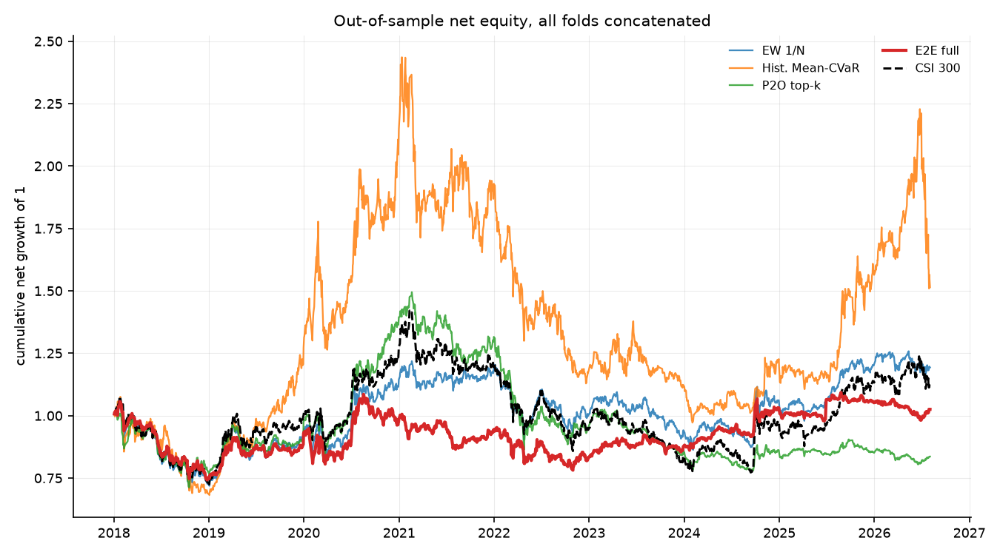
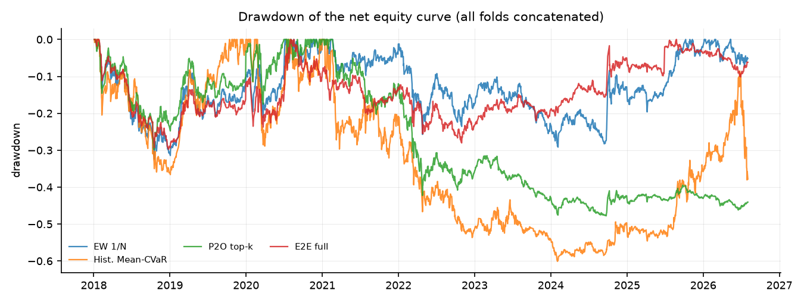
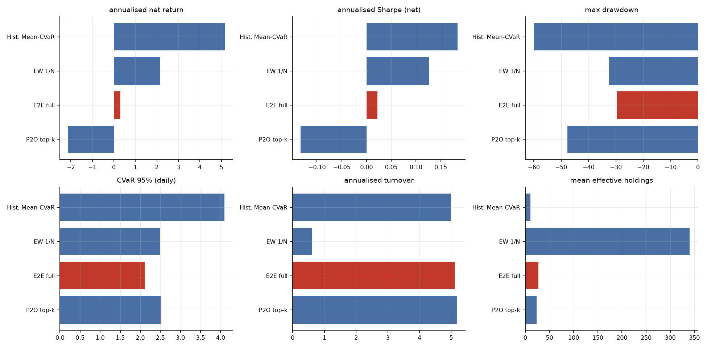
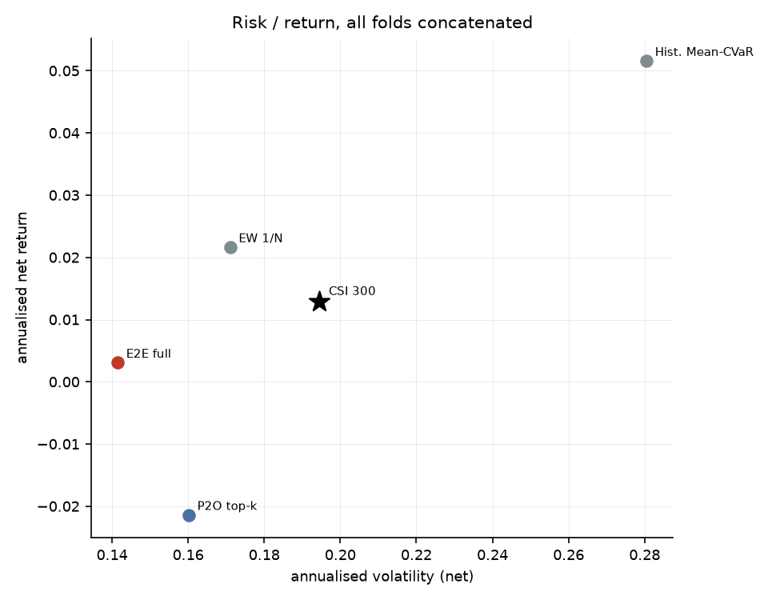
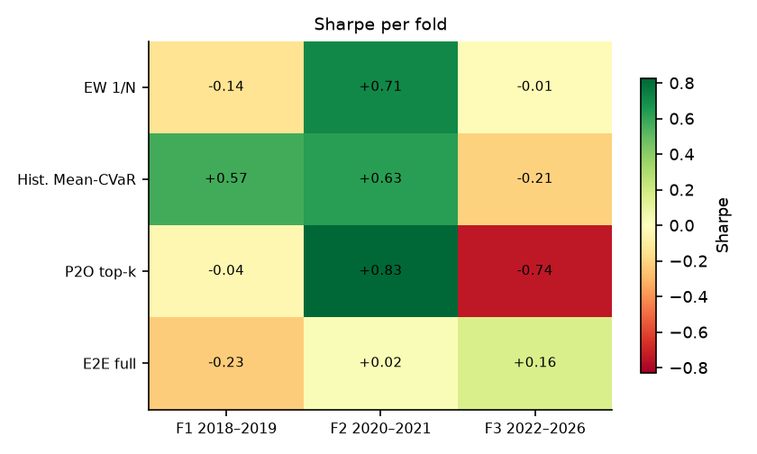
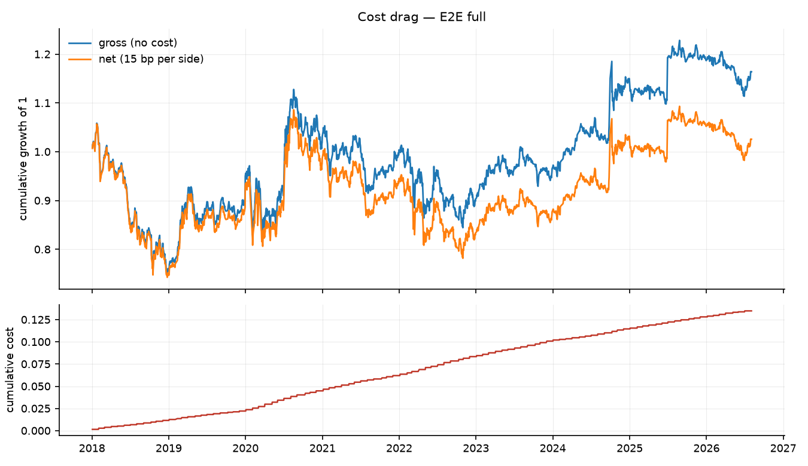
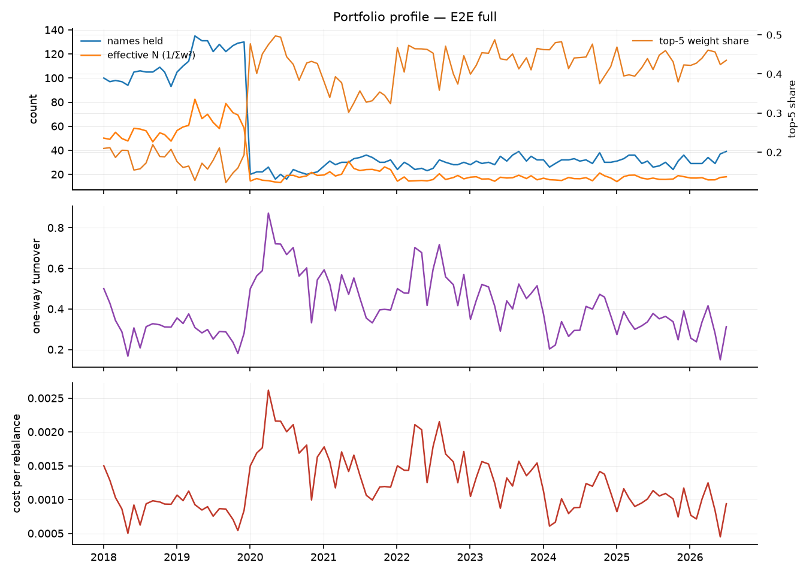

# 端到端可微 Mean-CVaR 投资组合学习 — 实验结果报告

- 运行目录：`csi300_full_universe`
- 运行耗时：92.3 分钟，作业 12/12 成功
- 样本：沪深 300 动态成分股，测试窗口 3 折拼接，VaR/CVaR 置信水平 95%
- 成本假设：单边 15.00 bp，线性；换手率按单边（½·Σ|Δw|）统计，并按实际调仓频率年化

## 0. 折划分

| 折 | 训练起 | 训练止 | 验证起 | 验证止 | 测试起 | 测试止 |
|---|---|---|---|---|---|---|
| f1_2018_2019 | 2010-01-01 | 2016-12-31 | 2017-01-01 | 2017-12-31 | 2018-01-01 | 2019-12-31 |
| f2_2020_2021 | 2010-01-01 | 2018-12-31 | 2019-01-01 | 2019-12-31 | 2020-01-01 | 2021-12-31 |
| f3_2022_2026 | 2010-01-01 | 2020-12-31 | 2021-01-01 | 2021-12-31 | 2022-01-01 | 2026-12-31 |

## 1. 主结果（所有折的样本外日收益拼接后重算）

| 实验 | 类别 | 年化净收益 | 年化波动 | Sharpe | 最大回撤 | CVaR95(日) | 年化换手 | 有效持仓 | 成本拖累 |
|---|---|---|---|---|---|---|---|---|---|
| meancvar_hist | baseline | 5.16% | 28.05% | 0.18 | -60.08% | 4.10% | 5.00 | 10.72 | 1.59% |
| ew | baseline | 2.16% | 17.11% | 0.13 | -32.42% | 2.49% | 0.60 | 340.40 | 0.18% |
| full | e2e | 0.31% | 14.15% | 0.02 | -29.74% | 2.11% | 5.11 | 27.43 | 1.55% |
| lstm_topk | main | -2.14% | 16.02% | -0.13 | -47.76% | 2.52% | 5.19 | 23.20 | 1.54% |

### 1.2 持仓数量与集中度（Plan §6 要求项）

逐次调仓统计后取均值；HHI = Σw²，Top-5 与最大权重为占组合比例。

| 实验 | 类别 | 持仓数(>1e-3) | 有效持仓 1/Σw² | HHI Σw² | 前5大权重 | 最大单一权重 |
|---|---|---|---|---|---|---|
| meancvar_hist | baseline | 12.69 | 10.72 | 0.09 | 50.76% | 10.44% |
| ew | baseline | 342.56 | 340.40 | 0.00 | 1.93% | 0.43% |
| full | e2e | 48.60 | 27.43 | 0.05 | 36.60% | 8.49% |
| lstm_topk | main | 36.46 | 23.20 | 0.04 | 33.72% | 9.00% |

## 2. 分折结果

### 2.1 Sharpe

| 实验 | 折 | Sharpe | 年化净收益 | 最大回撤 | CVaR95(日) |
|---|---|---|---|---|---|
| ew | f1_2018_2019 | -0.14 | -2.70% | -32.42% | 2.82% |
| ew | f2_2020_2021 | 0.71 | 13.16% | -15.35% | 2.71% |
| ew | f3_2022_2026 | -0.01 | -0.20% | -27.54% | 2.19% |
| full | f1_2018_2019 | -0.23 | -3.40% | -29.74% | 2.28% |
| full | f2_2020_2021 | 0.02 | 0.42% | -20.30% | 2.53% |
| full | f3_2022_2026 | 0.16 | 1.93% | -17.95% | 1.72% |
| lstm_topk | f1_2018_2019 | -0.04 | -0.78% | -29.74% | 2.73% |
| lstm_topk | f2_2020_2021 | 0.83 | 15.97% | -20.21% | 2.94% |
| lstm_topk | f3_2022_2026 | -0.74 | -9.71% | -38.92% | 2.06% |
| meancvar_hist | f1_2018_2019 | 0.57 | 15.19% | -36.59% | 3.63% |
| meancvar_hist | f2_2020_2021 | 0.63 | 21.77% | -32.09% | 4.95% |
| meancvar_hist | f3_2022_2026 | -0.21 | -5.27% | -48.31% | 3.74% |

## 3. 选择层诊断

3. **在该范式下只有 top-k 是真正稀疏的选择器**：支撑集恒为 25 只（等于配置的 `topk = 25`），实际账本平均持有 36.5 只、有效持仓 23.2 只（单票 10% 上限把权重摊薄，所以有效持仓明显少于名义持仓）；相比之下 softmax / sparsemax 的账本摊到 nan 只左右。

| 实验 | 折 | 选择器 | 编码器哈希 | 期数 | 可投资 | logit 极差 | 稀疏临界 1/n | 极差<1/n 占比 | π 支撑集 | π 有效数 | 账本持仓 | 账本有效持仓 |
|---|---|---|---|---|---|---|---|---|---|---|---|---|
| full | f1_2018_2019 | sparsemax | 6869f5702c0bea7b | 24 | 286.21 | 2.40e-02 | 3.50e-03 | 0.00% | 108.67 | 77.46 | 112.42 | 59.16 |
| full | f2_2020_2021 | sparsemax | 16f0307a130e5bbb | 24 | 293.83 | 5.67e-02 | 3.40e-03 | 0.00% | 20.71 | 12.03 | 26.08 | 20.10 |
| full | f3_2022_2026 | sparsemax | f583eab64db23dc1 | 55 | 298.38 | 4.87e-02 | 3.35e-03 | 0.00% | 79.24 | 53.48 | 30.58 | 16.78 |
| lstm_topk | f1_2018_2019 | topk | e82d179d46b41a14 | 24 | 286.21 | 1.75e-03 | 3.50e-03 | 100.00% | 25.00 | 25.00 | 29.83 | 22.69 |
| lstm_topk | f2_2020_2021 | topk | 4012fd9ed3591275 | 24 | 293.83 | 1.01e-02 | 3.40e-03 | 0.00% | 25.00 | 25.00 | 29.79 | 21.56 |
| lstm_topk | f3_2022_2026 | topk | c23b77b00e71580f | 55 | 298.38 | 2.50e-02 | 3.35e-03 | 0.00% | 25.00 | 25.00 | 42.25 | 24.14 |

> 诊断口径：重放测试期并只跑编码器（`run_layer=False`），以空账本（`prev = 0`）隔离选择层本身；`book_*` 列读自回测写出的 `weights.csv`，因此与 `pi_*` 的差别来自不可卖出持仓的结转与优化层。

## 4. 结论

1. **整体排序**：在全部 3 折测试窗口拼接后的样本上，夏普比率最高的是 `meancvar_hist`（Sharpe 0.18，年化净收益 5.16%，最大回撤 -60.08%）。基准（等权 1/N）的年化净收益为 2.16%，传统历史情景 Mean-CVaR 为 5.16%。
5. **相对等权基线的真实超额**：`full` 年化净收益 0.31%，等权 2.16%；信息比率 -0.15，alpha -0.45%，beta 0.55。最大回撤从 -32.42% 收窄到 -29.74%。
6. **风险与成本**：`full` 的日 CVaR(95%) 为 2.11%，年化波动 14.15%，平均持仓 48.6 只、有效持仓 27.4 只，年化单边换手 5.11，成本拖累（毛收益−净收益）1.55%。
7. **跨折稳定性**：没有任何实验在全部 3 折上都取得正夏普；正夏普折数最多的是 `meancvar_hist`（2/3 折，最差 -0.21 / 最好 +0.63）。所有策略在不同年份区间上都有明显波动，单折结论不足以支撑泛化性判断。
8. **解读与局限**：结论受限于（a）单一指数（沪深 300 动态成分股）与单一成本假设（单边 15 bp 线性成本，未建模冲击成本与涨跌停延迟成交）；（b）测试窗口只有 3 折、共约 8 年，统计功效有限；（c）场景生成是高斯参数化模型，CVaR 只对模型隐含分布稳健；（d）深度网络的随机性使同一配置重复训练仍会有数个百分点差异，报告中的差异若小于该量级不应视为真实效应；（e）资产槽位数 `n_max` 由每折的可投资域决定（f1/f2/f3 = 154/155/165），它通过 `Dropout` 的随机数消耗量影响训练轨迹，因此**跨折的绝对值不可直接横向比较**（仓库内同一折的所有实验共用同一个 `n_max`，折内比较仍然成立）；（f）选择层的稀疏不等于组合稀疏——单票 10% 上限会把权重摊到更多票上，有效持仓应看回测输出的 `eff_holdings`（`full` 为 27.4 只），而不是 π 的支撑集大小。

## 5. 图表
















## 6. 复现

```bash
python scripts/01_prepare_data.py --validate
python scripts/02_run_experiments.py --config results/csi300_full_universe/config.yaml --workers 4
python scripts/04_selection_diagnostics.py --run results/csi300_full_universe
python scripts/03_report.py --run results/csi300_full_universe
```

> 每次运行都会把**解析后的完整配置**复制到运行目录的 `config.yaml`，因此上面第二条命令对基线网格（`configs/csi300.yaml`）、固定分数规则网格（`configs/csi300_score_rule.yaml`）和全样本扩展网格（`configs/csi300_full_universe.yaml`）都成立。
