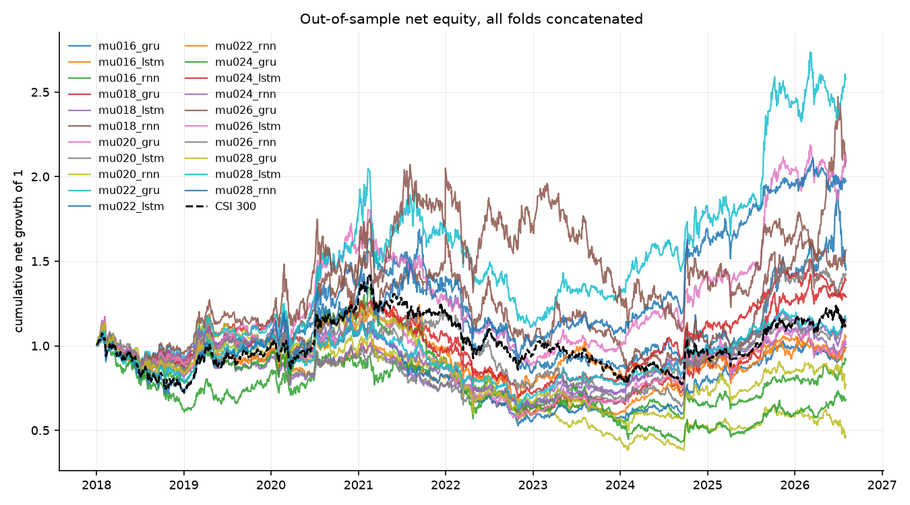
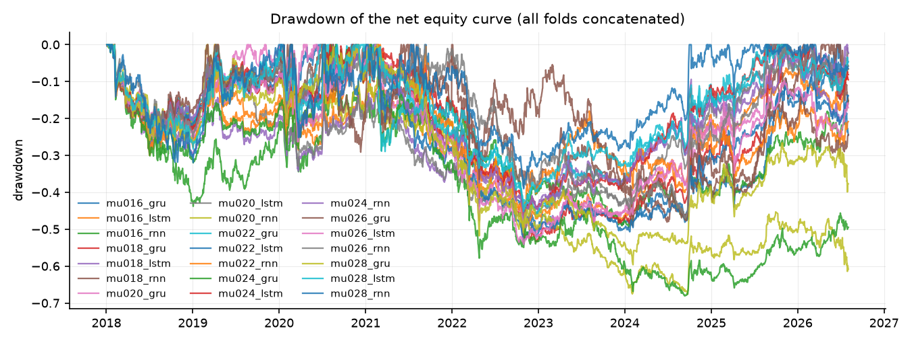
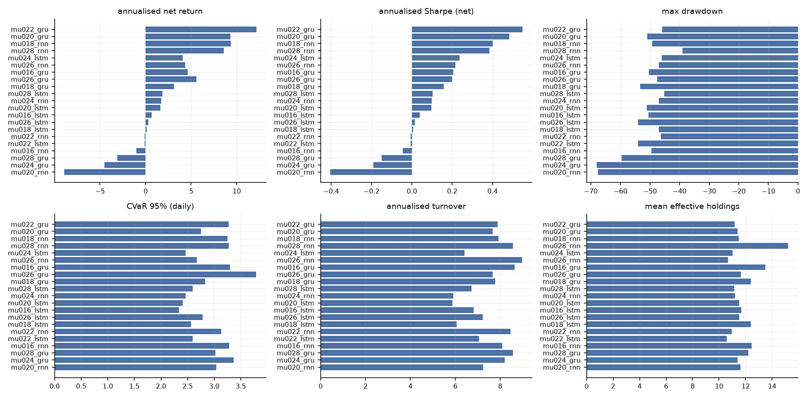
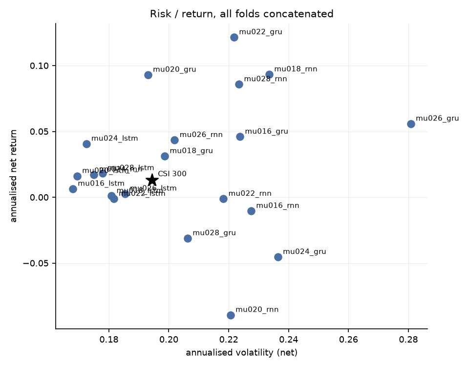
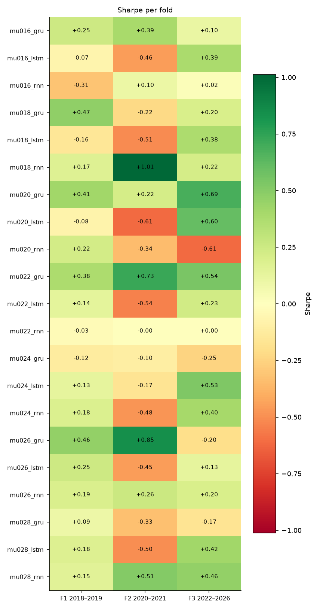

# 端到端可微 Mean-CVaR 投资组合学习 — 实验结果报告

- 运行目录：`csi300_mu_sweep_20260912`
- 运行耗时：261.0 分钟，作业 54/54 成功
- 样本：沪深 300 动态成分股，测试窗口 3 折拼接，VaR/CVaR 置信水平 95%
- 成本假设：单边 15.00 bp，线性；换手率按单边（½·Σ|Δw|）统计，并按实际调仓频率年化

## 0. 折划分

| 折 | 训练起 | 训练止 | 验证起 | 验证止 | 测试起 | 测试止 |
|---|---|---|---|---|---|---|
| f1_2018_2019 | 2010-01-01 | 2016-12-31 | 2017-01-01 | 2017-12-31 | 2018-01-01 | 2019-12-31 |
| f2_2020_2021 | 2010-01-01 | 2018-12-31 | 2019-01-01 | 2019-12-31 | 2020-01-01 | 2021-12-31 |
| f3_2022_2026 | 2010-01-01 | 2020-12-31 | 2021-01-01 | 2021-12-31 | 2022-01-01 | 2026-12-31 |

## 1. 主结果（所有折的样本外日收益拼接后重算）

| 实验 | 类别 | 年化净收益 | 年化波动 | Sharpe | 最大回撤 | CVaR95(日) | 年化换手 | 有效持仓 | 成本拖累 |
|---|---|---|---|---|---|---|---|---|---|
| mu022_gru | e2e | 12.15% | 22.18% | 0.55 | -45.87% | 3.27% | 7.88 | 11.17 | 2.69% |
| mu020_gru | e2e | 9.30% | 19.30% | 0.48 | -50.99% | 2.75% | 7.67 | 11.39 | 2.54% |
| mu018_rnn | e2e | 9.33% | 23.35% | 0.40 | -49.27% | 3.25% | 7.93 | 11.50 | 2.64% |
| mu028_rnn | e2e | 8.58% | 22.34% | 0.38 | -39.01% | 3.27% | 8.57 | 15.19 | 2.82% |
| mu024_lstm | e2e | 4.06% | 17.24% | 0.24 | -46.08% | 2.46% | 6.41 | 11.00 | 2.02% |
| mu026_rnn | e2e | 4.34% | 20.19% | 0.22 | -47.03% | 2.68% | 8.97 | 10.67 | 2.85% |
| mu016_gru | e2e | 4.60% | 22.37% | 0.21 | -50.41% | 3.30% | 8.64 | 13.48 | 2.75% |
| mu026_gru | e2e | 5.59% | 28.08% | 0.20 | -47.62% | 3.78% | 7.66 | 11.63 | 2.46% |
| mu018_gru | e2e | 3.12% | 19.86% | 0.16 | -53.37% | 2.83% | 7.77 | 12.38 | 2.43% |
| mu028_lstm | e2e | 1.83% | 17.78% | 0.10 | -45.15% | 2.60% | 6.73 | 11.13 | 2.07% |
| mu024_rnn | e2e | 1.73% | 17.50% | 0.10 | -47.09% | 2.46% | 5.92 | 11.21 | 1.82% |
| mu020_lstm | e2e | 1.62% | 16.94% | 0.10 | -51.15% | 2.40% | 5.88 | 11.52 | 1.81% |
| mu016_lstm | e2e | 0.64% | 16.79% | 0.04 | -50.48% | 2.34% | 6.82 | 11.67 | 2.08% |
| mu026_lstm | e2e | 0.28% | 18.54% | 0.02 | -54.07% | 2.78% | 7.22 | 11.52 | 2.20% |
| mu018_lstm | e2e | 0.10% | 18.09% | 0.01 | -47.09% | 2.56% | 6.06 | 12.38 | 1.84% |
| mu022_rnn | e2e | -0.12% | 21.82% | -0.01 | -46.28% | 3.13% | 8.46 | 10.94 | 2.57% |
| mu022_lstm | e2e | -0.12% | 18.16% | -0.01 | -54.08% | 2.59% | 7.05 | 10.59 | 2.14% |
| mu016_rnn | e2e | -1.04% | 22.75% | -0.05 | -49.59% | 3.28% | 8.09 | 12.45 | 2.43% |
| mu028_gru | e2e | -3.11% | 20.63% | -0.15 | -59.60% | 3.02% | 8.57 | 12.19 | 2.53% |
| mu024_gru | e2e | -4.54% | 23.64% | -0.19 | -68.04% | 3.37% | 8.19 | 11.39 | 2.38% |
| mu020_rnn | e2e | -8.94% | 22.06% | -0.41 | -67.63% | 3.04% | 7.25 | 11.62 | 2.01% |

### 1.2 持仓数量与集中度（Plan §6 要求项）

逐次调仓统计后取均值；HHI = Σw²，Top-5 与最大权重为占组合比例。

| 实验 | 类别 | 持仓数(>1e-3) | 有效持仓 1/Σw² | HHI Σw² | 前5大权重 | 最大单一权重 |
|---|---|---|---|---|---|---|
| mu022_gru | e2e | 16.61 | 11.17 | 0.09 | 49.99% | 10.00% |
| mu020_gru | e2e | 17.19 | 11.39 | 0.09 | 49.87% | 10.00% |
| mu018_rnn | e2e | 18.07 | 11.50 | 0.09 | 50.92% | 10.91% |
| mu028_rnn | e2e | 22.92 | 15.19 | 0.07 | 44.09% | 9.63% |
| mu024_lstm | e2e | 14.56 | 11.00 | 0.09 | 49.86% | 10.00% |
| mu026_rnn | e2e | 13.65 | 10.67 | 0.09 | 50.00% | 10.01% |
| mu016_gru | e2e | 27.43 | 13.48 | 0.08 | 48.81% | 10.02% |
| mu026_gru | e2e | 16.23 | 11.63 | 0.09 | 49.93% | 10.21% |
| mu018_gru | e2e | 17.25 | 12.38 | 0.08 | 48.61% | 10.00% |
| mu028_lstm | e2e | 14.45 | 11.13 | 0.09 | 49.86% | 10.00% |
| mu024_rnn | e2e | 16.10 | 11.21 | 0.09 | 49.98% | 10.00% |
| mu020_lstm | e2e | 15.48 | 11.52 | 0.09 | 49.87% | 10.00% |
| mu016_lstm | e2e | 16.69 | 11.67 | 0.09 | 49.85% | 10.00% |
| mu026_lstm | e2e | 16.06 | 11.52 | 0.09 | 49.88% | 10.02% |
| mu018_lstm | e2e | 21.70 | 12.38 | 0.08 | 49.32% | 9.98% |
| mu022_rnn | e2e | 14.40 | 10.94 | 0.09 | 49.98% | 10.01% |
| mu022_lstm | e2e | 12.78 | 10.59 | 0.09 | 49.99% | 10.00% |
| mu016_rnn | e2e | 16.95 | 12.45 | 0.08 | 47.80% | 9.94% |
| mu028_gru | e2e | 17.84 | 12.19 | 0.08 | 49.59% | 10.26% |
| mu024_gru | e2e | 15.53 | 11.39 | 0.09 | 50.36% | 10.49% |
| mu020_rnn | e2e | 17.10 | 11.62 | 0.09 | 49.80% | 10.02% |

## 2. 分折结果

### 2.1 Sharpe

| 实验 | 折 | Sharpe | 年化净收益 | 最大回撤 | CVaR95(日) |
|---|---|---|---|---|---|
| mu016_gru | f1_2018_2019 | 0.25 | 4.82% | -26.70% | 2.76% |
| mu016_gru | f2_2020_2021 | 0.39 | 9.64% | -22.52% | 3.67% |
| mu016_gru | f3_2022_2026 | 0.10 | 2.36% | -35.45% | 3.28% |
| mu016_lstm | f1_2018_2019 | -0.07 | -1.25% | -28.02% | 2.67% |
| mu016_lstm | f2_2020_2021 | -0.46 | -8.66% | -24.56% | 2.50% |
| mu016_lstm | f3_2022_2026 | 0.39 | 5.90% | -32.95% | 2.04% |
| mu016_rnn | f1_2018_2019 | -0.31 | -7.76% | -43.79% | 3.52% |
| mu016_rnn | f2_2020_2021 | 0.10 | 2.64% | -20.20% | 4.07% |
| mu016_rnn | f3_2022_2026 | 0.02 | 0.45% | -39.42% | 2.56% |
| mu018_gru | f1_2018_2019 | 0.47 | 8.53% | -24.58% | 2.56% |
| mu018_gru | f2_2020_2021 | -0.22 | -4.38% | -19.24% | 2.55% |
| mu018_gru | f3_2022_2026 | 0.20 | 4.23% | -44.56% | 3.02% |
| mu018_lstm | f1_2018_2019 | -0.16 | -3.07% | -30.19% | 2.86% |
| mu018_lstm | f2_2020_2021 | -0.51 | -9.86% | -28.22% | 2.71% |
| mu018_lstm | f3_2022_2026 | 0.38 | 6.31% | -22.95% | 2.31% |
| mu018_rnn | f1_2018_2019 | 0.17 | 2.91% | -23.15% | 2.46% |
| mu018_rnn | f2_2020_2021 | 1.01 | 26.57% | -23.79% | 3.93% |
| mu018_rnn | f3_2022_2026 | 0.22 | 5.30% | -48.02% | 3.17% |
| mu020_gru | f1_2018_2019 | 0.41 | 7.54% | -25.71% | 2.65% |
| mu020_gru | f2_2020_2021 | 0.22 | 5.20% | -30.98% | 3.51% |
| mu020_gru | f3_2022_2026 | 0.69 | 11.95% | -31.37% | 2.33% |
| mu020_lstm | f1_2018_2019 | -0.08 | -1.47% | -24.00% | 2.71% |
| mu020_lstm | f2_2020_2021 | -0.61 | -11.21% | -25.75% | 2.47% |
| mu020_lstm | f3_2022_2026 | 0.60 | 9.29% | -28.07% | 2.19% |
| mu020_rnn | f1_2018_2019 | 0.22 | 3.94% | -23.15% | 2.52% |
| mu020_rnn | f2_2020_2021 | -0.34 | -7.60% | -20.27% | 3.13% |
| mu020_rnn | f3_2022_2026 | -0.61 | -14.63% | -58.06% | 3.18% |
| mu022_gru | f1_2018_2019 | 0.38 | 6.73% | -24.83% | 2.55% |
| mu022_gru | f2_2020_2021 | 0.73 | 22.40% | -28.94% | 4.66% |
| mu022_gru | f3_2022_2026 | 0.54 | 10.31% | -34.30% | 2.59% |
| mu022_lstm | f1_2018_2019 | 0.14 | 2.31% | -25.40% | 2.50% |
| mu022_lstm | f2_2020_2021 | -0.54 | -11.23% | -32.20% | 3.00% |
| mu022_lstm | f3_2022_2026 | 0.23 | 4.07% | -36.47% | 2.43% |
| mu022_rnn | f1_2018_2019 | -0.03 | -0.55% | -29.97% | 2.88% |
| mu022_rnn | f2_2020_2021 | -0.00 | -0.06% | -22.37% | 3.23% |
| mu022_rnn | f3_2022_2026 | 0.00 | 0.04% | -30.12% | 3.16% |
| mu024_gru | f1_2018_2019 | -0.12 | -2.32% | -32.01% | 2.81% |
| mu024_gru | f2_2020_2021 | -0.10 | -2.58% | -33.92% | 3.74% |
| mu024_gru | f3_2022_2026 | -0.25 | -6.33% | -51.63% | 3.34% |
| mu024_lstm | f1_2018_2019 | 0.13 | 2.27% | -23.57% | 2.51% |
| mu024_lstm | f2_2020_2021 | -0.17 | -3.53% | -27.18% | 2.86% |
| mu024_lstm | f3_2022_2026 | 0.53 | 8.41% | -30.92% | 2.20% |
| mu024_rnn | f1_2018_2019 | 0.18 | 3.22% | -25.02% | 2.48% |
| mu024_rnn | f2_2020_2021 | -0.48 | -9.63% | -27.38% | 2.59% |
| mu024_rnn | f3_2022_2026 | 0.40 | 6.46% | -30.83% | 2.37% |
| mu026_gru | f1_2018_2019 | 0.46 | 8.60% | -25.78% | 2.67% |
| mu026_gru | f2_2020_2021 | 0.85 | 31.93% | -29.11% | 5.00% |
| mu026_gru | f3_2022_2026 | -0.20 | -5.42% | -45.24% | 3.35% |
| mu026_lstm | f1_2018_2019 | 0.25 | 4.40% | -25.43% | 2.59% |
| mu026_lstm | f2_2020_2021 | -0.45 | -8.23% | -28.21% | 2.72% |
| mu026_lstm | f3_2022_2026 | 0.13 | 2.43% | -35.87% | 2.88% |
| mu026_rnn | f1_2018_2019 | 0.19 | 3.50% | -25.42% | 2.60% |
| mu026_rnn | f2_2020_2021 | 0.26 | 5.87% | -16.92% | 2.89% |
| mu026_rnn | f3_2022_2026 | 0.20 | 4.05% | -45.64% | 2.57% |
| mu028_gru | f1_2018_2019 | 0.09 | 1.73% | -26.74% | 2.92% |
| mu028_gru | f2_2020_2021 | -0.33 | -6.35% | -29.57% | 2.65% |
| mu028_gru | f3_2022_2026 | -0.17 | -3.74% | -44.11% | 3.22% |
| mu028_lstm | f1_2018_2019 | 0.18 | 3.66% | -28.27% | 2.97% |
| mu028_lstm | f2_2020_2021 | -0.50 | -9.77% | -24.56% | 2.75% |
| mu028_lstm | f3_2022_2026 | 0.42 | 6.54% | -30.32% | 2.26% |
| mu028_rnn | f1_2018_2019 | 0.15 | 3.68% | -31.93% | 3.31% |
| mu028_rnn | f2_2020_2021 | 0.51 | 15.09% | -25.18% | 4.54% |
| mu028_rnn | f3_2022_2026 | 0.46 | 8.02% | -34.73% | 2.34% |

## 3. 选择层诊断

未找到 `report/selection_diagnostics.csv`。先运行

```bash
python scripts/04_selection_diagnostics.py --run csi300_mu_sweep_20260912
```
后重新生成本报告，即可看到选择层（支撑集 / 仓位上限）的逐期诊断。

## 4. 结论

1. **整体排序**：在全部 3 折测试窗口拼接后的样本上，夏普比率最高的是 `mu022_gru`（Sharpe 0.55，年化净收益 12.15%，最大回撤 -45.87%）。基准（等权 1/N）的年化净收益为 n/a，传统历史情景 Mean-CVaR 为 n/a。
7. **跨折稳定性**：只有 `mu022_gru`, `mu020_gru`, `mu018_rnn`, `mu028_rnn`, `mu026_rnn`, `mu016_gru` 在全部 3 折上夏普为正；正夏普折数最多的是 `mu022_gru`（3/3 折，最差 +0.38 / 最好 +0.73）。所有策略在不同年份区间上都有明显波动，单折结论不足以支撑泛化性判断。
8. **解读与局限**：结论受限于（a）单一指数（沪深 300 动态成分股）与单一成本假设（单边 15 bp 线性成本，未建模冲击成本与涨跌停延迟成交）；（b）测试窗口只有 3 折、共约 8 年，统计功效有限；（c）场景生成是高斯参数化模型，CVaR 只对模型隐含分布稳健；（d）深度网络的随机性使同一配置重复训练仍会有数个百分点差异，报告中的差异若小于该量级不应视为真实效应；（e）资产槽位数 `n_max` 由每折的可投资域决定（f1/f2/f3 = 154/155/165），它通过 `Dropout` 的随机数消耗量影响训练轨迹，因此**跨折的绝对值不可直接横向比较**（仓库内同一折的所有实验共用同一个 `n_max`，折内比较仍然成立）；（f）选择层的稀疏不等于组合稀疏——单票 10% 上限会把权重摊到更多票上，有效持仓应看回测输出的 `eff_holdings`（`full` 为 n/a 只），而不是 π 的支撑集大小。

## 5. 图表











## 6. 复现

```bash
python scripts/01_prepare_data.py --validate
python scripts/02_run_experiments.py --config results/csi300_mu_sweep_20260912/config.yaml --workers 4
python scripts/04_selection_diagnostics.py --run results/csi300_mu_sweep_20260912
python scripts/03_report.py --run results/csi300_mu_sweep_20260912
```

> 每次运行都会把**解析后的完整配置**复制到运行目录的 `config.yaml`，因此上面第二条命令对基线网格（`configs/csi300.yaml`）、固定分数规则网格（`configs/csi300_score_rule.yaml`）和全样本扩展网格（`configs/csi300_full_universe.yaml`）都成立。
