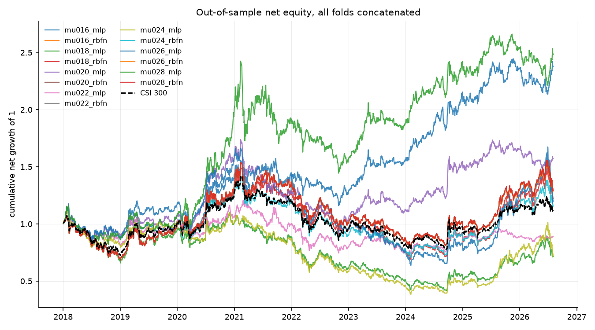
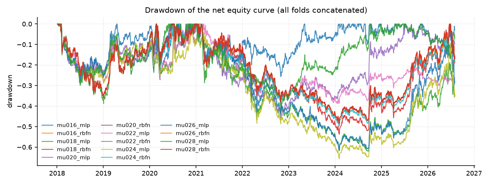
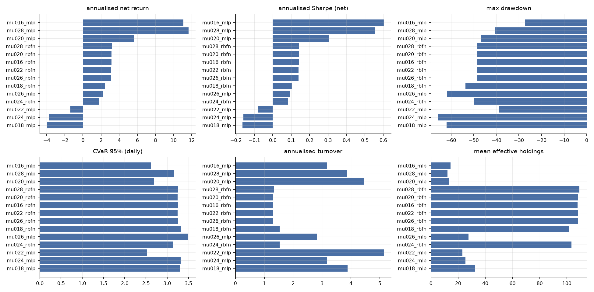
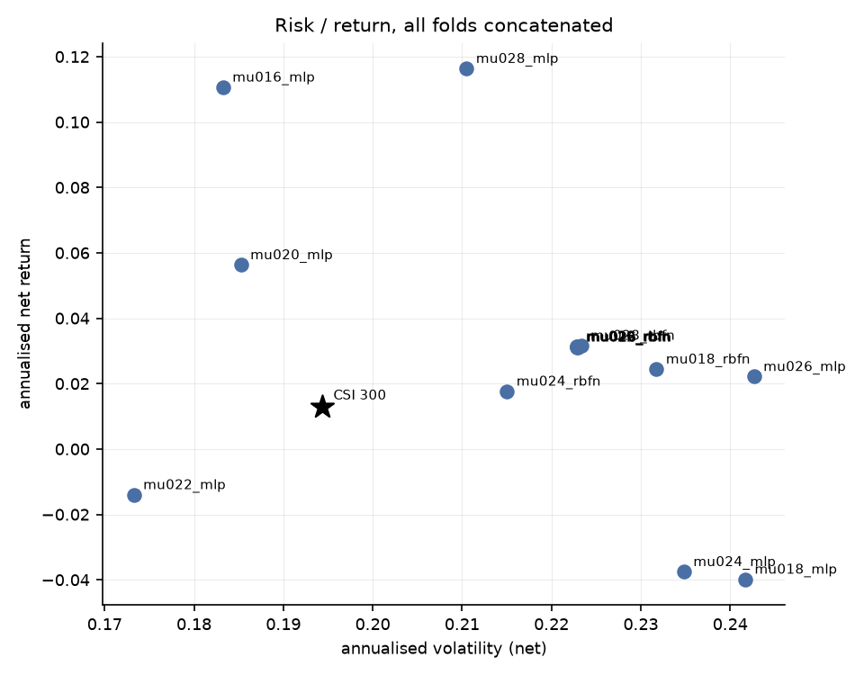
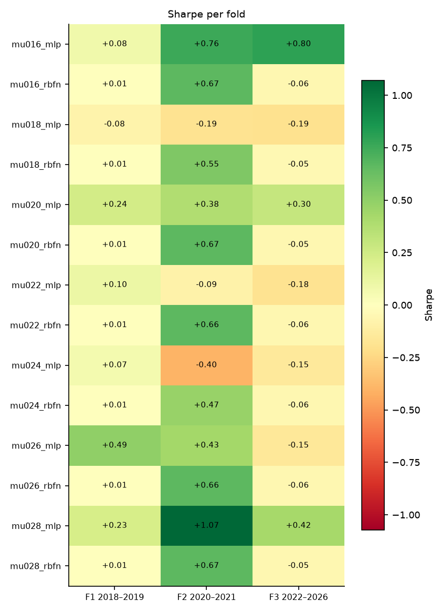

# 端到端可微 Mean-CVaR 投资组合学习 — 实验结果报告

- 运行目录：`csi300_mu_sweep_ext_20260912`
- 运行耗时：72.0 分钟，作业 14/14 成功
- 样本：沪深 300 动态成分股，测试窗口 3 折拼接，VaR/CVaR 置信水平 95%
- 成本假设：单边 15.00 bp，线性；换手率按单边（½·Σ|Δw|）统计，并按实际调仓频率年化

## 0. 折划分

| 折 | 训练起 | 训练止 | 验证起 | 验证止 | 测试起 | 测试止 |
|---|---|---|---|---|---|---|
| f1_2018_2019 | 2010-01-01 | 2016-12-31 | 2017-01-01 | 2017-12-31 | 2018-01-01 | 2019-12-31 |
| f2_2020_2021 | 2010-01-01 | 2018-12-31 | 2019-01-01 | 2019-12-31 | 2020-01-01 | 2021-12-31 |
| f3_2022_2026 | 2010-01-01 | 2020-12-31 | 2021-01-01 | 2021-12-31 | 2022-01-01 | 2026-12-31 |

## 1. 主结果（所有折的样本外日收益拼接后重算）

| 实验 | 类别 | 年化净收益 | 年化波动 | Sharpe | 最大回撤 | CVaR95(日) | 年化换手 | 有效持仓 | 成本拖累 |
|---|---|---|---|---|---|---|---|---|---|
| mu016_mlp | e2e | 11.07% | 18.33% | 0.60 | -27.19% | 2.61% | 3.16 | 14.49 | 1.06% |
| mu028_mlp | e2e | 11.64% | 21.05% | 0.55 | -40.45% | 3.16% | 3.85 | 12.14 | 1.29% |
| mu020_mlp | e2e | 5.64% | 18.53% | 0.30 | -46.76% | 2.69% | 4.47 | 13.03 | 1.42% |
| mu028_rbfn | e2e | 3.17% | 22.33% | 0.14 | -48.50% | 3.26% | 1.33 | 109.13 | 0.41% |
| mu020_rbfn | e2e | 3.15% | 22.28% | 0.14 | -48.52% | 3.25% | 1.31 | 108.30 | 0.41% |
| mu016_rbfn | e2e | 3.14% | 22.29% | 0.14 | -48.59% | 3.25% | 1.30 | 107.96 | 0.40% |
| mu022_rbfn | e2e | 3.12% | 22.28% | 0.14 | -48.57% | 3.25% | 1.31 | 108.22 | 0.41% |
| mu026_rbfn | e2e | 3.12% | 22.30% | 0.14 | -48.63% | 3.25% | 1.31 | 108.26 | 0.41% |
| mu018_rbfn | e2e | 2.45% | 23.18% | 0.11 | -53.67% | 3.32% | 1.53 | 101.64 | 0.47% |
| mu026_mlp | e2e | 2.22% | 24.27% | 0.09 | -61.67% | 3.49% | 2.82 | 27.73 | 0.87% |
| mu024_rbfn | e2e | 1.77% | 21.50% | 0.08 | -49.80% | 3.14% | 1.53 | 103.34 | 0.47% |
| mu022_mlp | e2e | -1.40% | 17.33% | -0.08 | -38.77% | 2.52% | 5.13 | 23.08 | 1.53% |
| mu024_mlp | e2e | -3.75% | 23.48% | -0.16 | -65.65% | 3.32% | 3.17 | 25.33 | 0.92% |
| mu018_mlp | e2e | -3.98% | 24.17% | -0.16 | -62.01% | 3.31% | 3.88 | 32.51 | 1.13% |

### 1.2 持仓数量与集中度（Plan §6 要求项）

逐次调仓统计后取均值；HHI = Σw²，Top-5 与最大权重为占组合比例。

| 实验 | 类别 | 持仓数(>1e-3) | 有效持仓 1/Σw² | HHI Σw² | 前5大权重 | 最大单一权重 |
|---|---|---|---|---|---|---|
| mu016_mlp | e2e | 25.09 | 14.49 | 0.08 | 46.25% | 9.78% |
| mu028_mlp | e2e | 18.04 | 12.14 | 0.08 | 49.47% | 10.00% |
| mu020_mlp | e2e | 17.95 | 13.03 | 0.08 | 46.79% | 9.69% |
| mu028_rbfn | e2e | 123.39 | 109.13 | 0.01 | 8.12% | 1.82% |
| mu020_rbfn | e2e | 123.39 | 108.30 | 0.01 | 8.15% | 1.80% |
| mu016_rbfn | e2e | 123.39 | 107.96 | 0.01 | 8.17% | 1.79% |
| mu022_rbfn | e2e | 123.39 | 108.22 | 0.01 | 8.17% | 1.80% |
| mu026_rbfn | e2e | 123.39 | 108.26 | 0.01 | 8.17% | 1.80% |
| mu018_rbfn | e2e | 121.85 | 101.64 | 0.01 | 9.87% | 2.23% |
| mu026_mlp | e2e | 67.75 | 27.73 | 0.05 | 34.33% | 8.92% |
| mu024_rbfn | e2e | 118.17 | 103.34 | 0.01 | 8.50% | 1.88% |
| mu022_mlp | e2e | 33.47 | 23.08 | 0.05 | 32.23% | 6.96% |
| mu024_mlp | e2e | 61.90 | 25.33 | 0.06 | 38.11% | 9.47% |
| mu018_mlp | e2e | 52.10 | 32.51 | 0.04 | 28.36% | 6.23% |

## 2. 分折结果

### 2.1 Sharpe

| 实验 | 折 | Sharpe | 年化净收益 | 最大回撤 | CVaR95(日) |
|---|---|---|---|---|---|
| mu016_mlp | f1_2018_2019 | 0.08 | 1.38% | -26.51% | 2.42% |
| mu016_mlp | f2_2020_2021 | 0.76 | 18.50% | -21.31% | 3.54% |
| mu016_mlp | f3_2022_2026 | 0.80 | 12.38% | -20.42% | 2.18% |
| mu016_rbfn | f1_2018_2019 | 0.01 | 0.18% | -36.00% | 3.20% |
| mu016_rbfn | f2_2020_2021 | 0.67 | 16.93% | -20.92% | 3.88% |
| mu016_rbfn | f3_2022_2026 | -0.06 | -1.13% | -40.68% | 2.94% |
| mu018_mlp | f1_2018_2019 | -0.08 | -1.86% | -38.83% | 3.36% |
| mu018_mlp | f2_2020_2021 | -0.19 | -4.33% | -25.03% | 3.02% |
| mu018_mlp | f3_2022_2026 | -0.19 | -4.75% | -51.06% | 3.37% |
| mu018_rbfn | f1_2018_2019 | 0.01 | 0.18% | -36.00% | 3.20% |
| mu018_rbfn | f2_2020_2021 | 0.55 | 13.47% | -19.67% | 3.73% |
| mu018_rbfn | f3_2022_2026 | -0.05 | -1.08% | -45.13% | 3.17% |
| mu020_mlp | f1_2018_2019 | 0.24 | 4.11% | -28.45% | 2.53% |
| mu020_mlp | f2_2020_2021 | 0.38 | 9.05% | -30.73% | 3.39% |
| mu020_mlp | f3_2022_2026 | 0.30 | 4.84% | -29.81% | 2.26% |
| mu020_rbfn | f1_2018_2019 | 0.01 | 0.18% | -36.00% | 3.20% |
| mu020_rbfn | f2_2020_2021 | 0.67 | 16.91% | -20.90% | 3.88% |
| mu020_rbfn | f3_2022_2026 | -0.05 | -1.10% | -40.59% | 2.94% |
| mu022_mlp | f1_2018_2019 | 0.10 | 1.99% | -28.58% | 2.82% |
| mu022_mlp | f2_2020_2021 | -0.09 | -1.71% | -22.87% | 2.78% |
| mu022_mlp | f3_2022_2026 | -0.18 | -2.71% | -25.78% | 2.12% |
| mu022_rbfn | f1_2018_2019 | 0.01 | 0.18% | -36.00% | 3.20% |
| mu022_rbfn | f2_2020_2021 | 0.66 | 16.84% | -20.87% | 3.87% |
| mu022_rbfn | f3_2022_2026 | -0.06 | -1.13% | -40.67% | 2.94% |
| mu024_mlp | f1_2018_2019 | 0.07 | 1.17% | -29.09% | 2.69% |
| mu024_mlp | f2_2020_2021 | -0.40 | -7.96% | -25.56% | 2.62% |
| mu024_mlp | f3_2022_2026 | -0.15 | -3.97% | -54.71% | 3.72% |
| mu024_rbfn | f1_2018_2019 | 0.01 | 0.18% | -36.00% | 3.20% |
| mu024_rbfn | f2_2020_2021 | 0.47 | 10.45% | -18.96% | 3.46% |
| mu024_rbfn | f3_2022_2026 | -0.06 | -1.14% | -40.69% | 2.94% |
| mu026_mlp | f1_2018_2019 | 0.49 | 9.44% | -27.69% | 2.72% |
| mu026_mlp | f2_2020_2021 | 0.43 | 10.16% | -21.67% | 3.58% |
| mu026_mlp | f3_2022_2026 | -0.15 | -4.01% | -54.36% | 3.69% |
| mu026_rbfn | f1_2018_2019 | 0.01 | 0.18% | -36.00% | 3.20% |
| mu026_rbfn | f2_2020_2021 | 0.66 | 16.86% | -20.89% | 3.87% |
| mu026_rbfn | f3_2022_2026 | -0.06 | -1.14% | -40.72% | 2.95% |
| mu028_mlp | f1_2018_2019 | 0.23 | 4.65% | -29.95% | 2.85% |
| mu028_mlp | f2_2020_2021 | 1.07 | 33.16% | -29.76% | 4.70% |
| mu028_mlp | f3_2022_2026 | 0.42 | 6.31% | -24.44% | 2.10% |
| mu028_rbfn | f1_2018_2019 | 0.01 | 0.18% | -36.00% | 3.20% |
| mu028_rbfn | f2_2020_2021 | 0.67 | 16.86% | -20.88% | 3.87% |
| mu028_rbfn | f3_2022_2026 | -0.05 | -1.04% | -40.59% | 2.96% |

## 3. 选择层诊断

未找到 `report/selection_diagnostics.csv`。先运行

```bash
python scripts/04_selection_diagnostics.py --run csi300_mu_sweep_ext_20260912
```
后重新生成本报告，即可看到选择层（支撑集 / 仓位上限）的逐期诊断。

## 4. 结论

1. **整体排序**：在全部 3 折测试窗口拼接后的样本上，夏普比率最高的是 `mu016_mlp`（Sharpe 0.60，年化净收益 11.07%，最大回撤 -27.19%）。基准（等权 1/N）的年化净收益为 n/a，传统历史情景 Mean-CVaR 为 n/a。
7. **跨折稳定性**：只有 `mu016_mlp`, `mu028_mlp`, `mu020_mlp` 在全部 3 折上夏普为正；正夏普折数最多的是 `mu020_mlp`（3/3 折，最差 +0.24 / 最好 +0.38）。所有策略在不同年份区间上都有明显波动，单折结论不足以支撑泛化性判断。
8. **解读与局限**：结论受限于（a）单一指数（沪深 300 动态成分股）与单一成本假设（单边 15 bp 线性成本，未建模冲击成本与涨跌停延迟成交）；（b）测试窗口只有 3 折、共约 8 年，统计功效有限；（c）场景生成是高斯参数化模型，CVaR 只对模型隐含分布稳健；（d）深度网络的随机性使同一配置重复训练仍会有数个百分点差异，报告中的差异若小于该量级不应视为真实效应；（e）资产槽位数 `n_max` 由每折的可投资域决定（f1/f2/f3 = 154/155/165），它通过 `Dropout` 的随机数消耗量影响训练轨迹，因此**跨折的绝对值不可直接横向比较**（仓库内同一折的所有实验共用同一个 `n_max`，折内比较仍然成立）；（f）选择层的稀疏不等于组合稀疏——单票 10% 上限会把权重摊到更多票上，有效持仓应看回测输出的 `eff_holdings`（`full` 为 n/a 只），而不是 π 的支撑集大小。

## 5. 图表











## 6. 复现

```bash
python scripts/01_prepare_data.py --validate
python scripts/02_run_experiments.py --config results/csi300_mu_sweep_ext_20260912/config.yaml --workers 4
python scripts/04_selection_diagnostics.py --run results/csi300_mu_sweep_ext_20260912
python scripts/03_report.py --run results/csi300_mu_sweep_ext_20260912
```

> 每次运行都会把**解析后的完整配置**复制到运行目录的 `config.yaml`，因此上面第二条命令对基线网格（`configs/csi300.yaml`）、固定分数规则网格（`configs/csi300_score_rule.yaml`）和全样本扩展网格（`configs/csi300_full_universe.yaml`）都成立。
