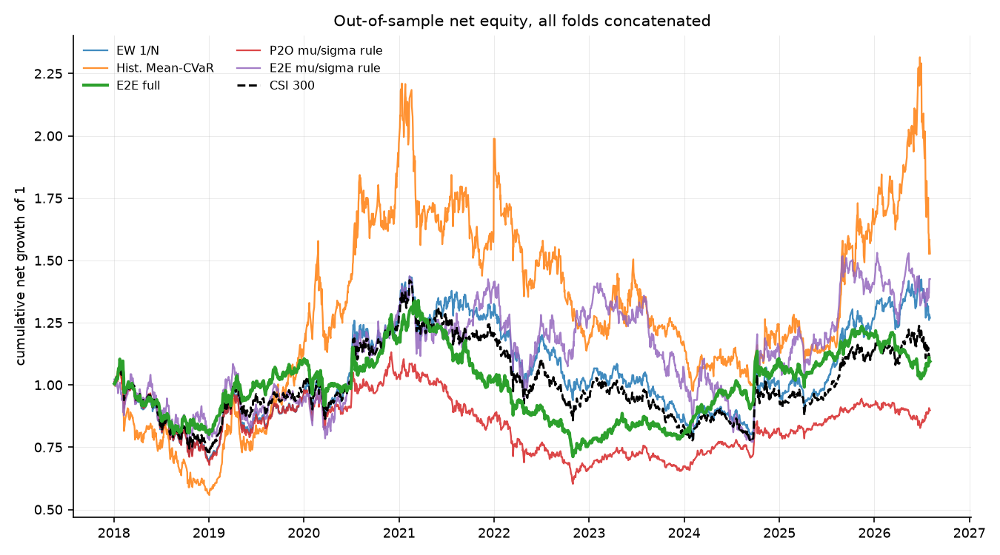
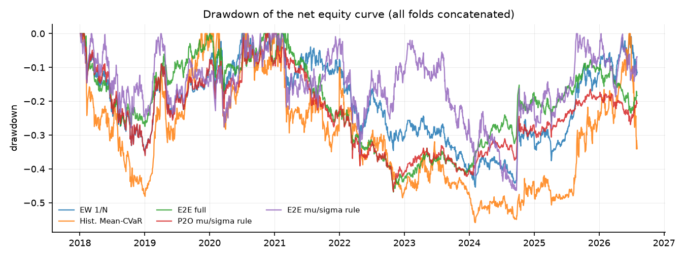
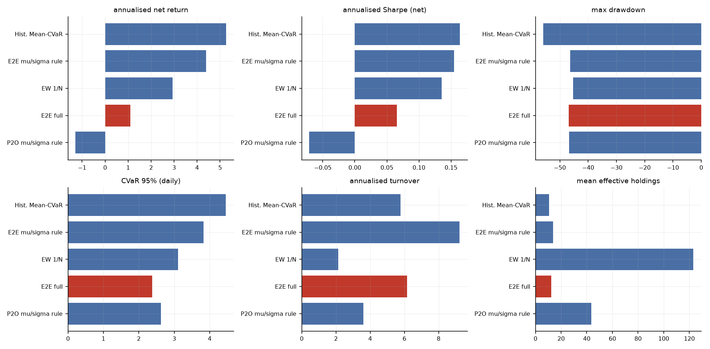
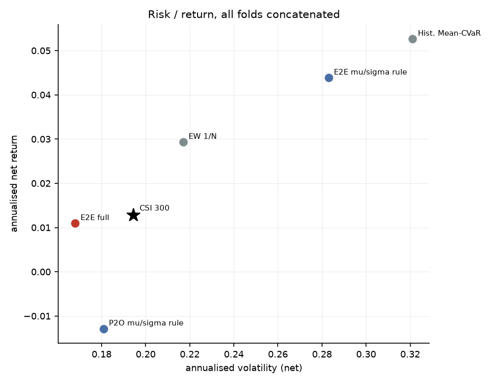
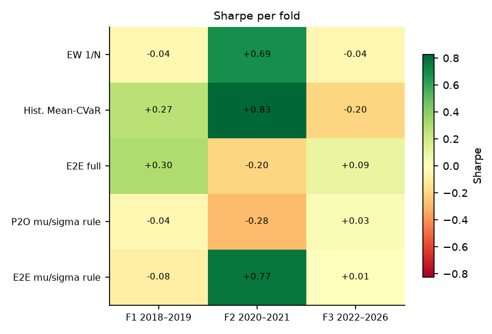
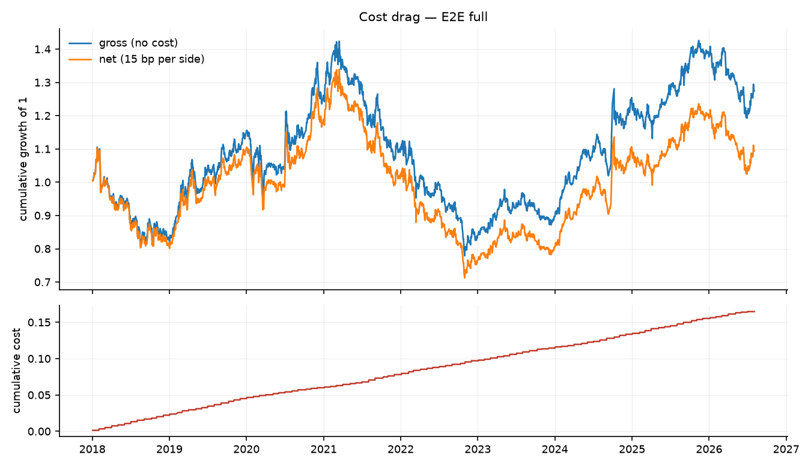

# 端到端可微 Mean-CVaR 投资组合学习 — 实验结果报告

- 运行目录：`csi300_score_rule_20260911`
- 运行耗时：20.9 分钟，作业 15/15 成功
- 样本：沪深 300 动态成分股，测试窗口 3 折拼接，VaR/CVaR 置信水平 95%
- 成本假设：单边 15.00 bp，线性；换手率按单边（½·Σ|Δw|）统计，并按实际调仓频率年化

## 0. 折划分

| 折 | 训练起 | 训练止 | 验证起 | 验证止 | 测试起 | 测试止 |
|---|---|---|---|---|---|---|
| f1_2018_2019 | 2010-01-01 | 2016-12-31 | 2017-01-01 | 2017-12-31 | 2018-01-01 | 2019-12-31 |
| f2_2020_2021 | 2010-01-01 | 2018-12-31 | 2019-01-01 | 2019-12-31 | 2020-01-01 | 2021-12-31 |
| f3_2022_2026 | 2010-01-01 | 2020-12-31 | 2021-01-01 | 2021-12-31 | 2022-01-01 | 2026-12-31 |

## 1. 主结果（所有折的样本外日收益拼接后重算）

| 实验 | 类别 | 年化净收益 | 年化波动 | Sharpe | 最大回撤 | CVaR95(日) | 年化换手 | 有效持仓 | 成本拖累 |
|---|---|---|---|---|---|---|---|---|---|
| meancvar_hist | baseline | 5.27% | 32.11% | 0.16 | -55.83% | 4.46% | 5.77 | 10.57 | 1.84% |
| full_musigma | ablation | 4.39% | 28.30% | 0.16 | -46.34% | 3.83% | 9.23 | 13.83 | 2.94% |
| ew | baseline | 2.94% | 21.71% | 0.14 | -45.38% | 3.11% | 2.13 | 123.11 | 0.66% |
| full | e2e | 1.10% | 16.80% | 0.07 | -46.82% | 2.38% | 6.16 | 12.20 | 1.88% |
| lstm_musigma | main | -1.29% | 18.09% | -0.07 | -46.70% | 2.63% | 3.60 | 43.46 | 1.07% |

### 1.2 持仓数量与集中度（Plan §6 要求项）

逐次调仓统计后取均值；HHI = Σw²，Top-5 与最大权重为占组合比例。

| 实验 | 类别 | 持仓数(>1e-3) | 有效持仓 1/Σw² | HHI Σw² | 前5大权重 | 最大单一权重 |
|---|---|---|---|---|---|---|
| meancvar_hist | baseline | 13.11 | 10.57 | 0.09 | 50.96% | 10.94% |
| full_musigma | ablation | 28.59 | 13.83 | 0.08 | 48.01% | 10.02% |
| ew | baseline | 123.39 | 123.11 | 0.01 | 4.43% | 1.02% |
| full | e2e | 22.39 | 12.20 | 0.08 | 49.71% | 10.00% |
| lstm_musigma | main | 61.99 | 43.46 | 0.04 | 27.68% | 6.54% |

## 2. 分折结果

### 2.1 Sharpe

| 实验 | 折 | Sharpe | 年化净收益 | 最大回撤 | CVaR95(日) |
|---|---|---|---|---|---|
| ew | f1_2018_2019 | -0.04 | -0.92% | -35.69% | 3.19% |
| ew | f2_2020_2021 | 0.69 | 16.47% | -17.88% | 3.61% |
| ew | f3_2022_2026 | -0.04 | -0.85% | -39.51% | 2.81% |
| full | f1_2018_2019 | 0.30 | 5.33% | -27.44% | 2.60% |
| full | f2_2020_2021 | -0.20 | -3.69% | -26.11% | 2.57% |
| full | f3_2022_2026 | 0.09 | 1.43% | -31.65% | 2.13% |
| full_musigma | f1_2018_2019 | -0.08 | -2.33% | -27.80% | 3.90% |
| full_musigma | f2_2020_2021 | 0.77 | 22.60% | -22.34% | 4.62% |
| full_musigma | f3_2022_2026 | 0.01 | 0.16% | -45.27% | 3.39% |
| lstm_musigma | f1_2018_2019 | -0.04 | -0.98% | -36.07% | 3.26% |
| lstm_musigma | f2_2020_2021 | -0.28 | -5.33% | -27.58% | 2.65% |
| lstm_musigma | f3_2022_2026 | 0.03 | 0.41% | -32.37% | 2.14% |
| meancvar_hist | f1_2018_2019 | 0.27 | 8.54% | -48.11% | 4.38% |
| meancvar_hist | f2_2020_2021 | 0.83 | 31.55% | -34.93% | 4.97% |
| meancvar_hist | f3_2022_2026 | -0.20 | -5.81% | -49.04% | 4.19% |

## 3. 选择层诊断

| 实验 | 折 | 选择器 | 编码器哈希 | 期数 | 可投资 | logit 极差 | 稀疏临界 1/n | 极差<1/n 占比 | π 支撑集 | π 有效数 | 账本持仓 | 账本有效持仓 |
|---|---|---|---|---|---|---|---|---|---|---|---|---|
| full | f1_2018_2019 | sparsemax | 6c62cd2651494db1 | 24 | 116.58 | 5.99e-02 | 8.58e-03 | 0.00% | 28.04 | 19.16 | 15.00 | 10.97 |
| full | f2_2020_2021 | sparsemax | 0e99f4391cfe02e5 | 24 | 118.75 | 2.82e-02 | 8.42e-03 | 0.00% | 58.25 | 39.28 | 25.29 | 12.75 |
| full | f3_2022_2026 | sparsemax | d9cdcf430fa5dd7e | 55 | 118.93 | 4.36e-02 | 8.41e-03 | 0.00% | 53.15 | 39.62 | 24.35 | 12.49 |
| full_musigma | f1_2018_2019 | sparsemax | 50a69037d386a291 | 24 | 116.58 | 4.27e-02 | 8.58e-03 | 0.00% | 52.08 | 37.36 | 26.08 | 13.01 |
| full_musigma | f2_2020_2021 | sparsemax | 5683f032b28287fb | 24 | 118.75 | 1.68e-02 | 8.42e-03 | 0.00% | 94.38 | 67.19 | 60.83 | 19.66 |
| full_musigma | f3_2022_2026 | sparsemax | e518bfce0dbe943a | 55 | 118.93 | 1.08e-01 | 8.41e-03 | 0.00% | 20.96 | 14.34 | 15.62 | 11.64 |
| lstm_musigma | f1_2018_2019 | sparsemax | b6cd80a7f6be1655 | 24 | 116.58 | 3.01e-03 | 8.58e-03 | 100.00% | 116.58 | 113.00 | 120.67 | 100.25 |
| lstm_musigma | f2_2020_2021 | sparsemax | 63f7a3b4feb50e78 | 24 | 118.75 | 6.09e-02 | 8.42e-03 | 0.00% | 43.79 | 24.17 | 36.38 | 15.79 |
| lstm_musigma | f3_2022_2026 | sparsemax | 05627ad04e3ee65e | 55 | 118.93 | 3.66e-02 | 8.41e-03 | 0.00% | 43.20 | 33.46 | 47.56 | 30.75 |

> 诊断口径：重放测试期并只跑编码器（`run_layer=False`），以空账本（`prev = 0`）隔离选择层本身；`book_*` 列读自回测写出的 `weights.csv`，因此与 `pi_*` 的差别来自不可卖出持仓的结转与优化层。

## 4. 结论

1. **整体排序**：在全部 3 折测试窗口拼接后的样本上，夏普比率最高的是 `meancvar_hist`（Sharpe 0.16，年化净收益 5.27%，最大回撤 -55.83%）。基准（等权 1/N）的年化净收益为 2.94%，传统历史情景 Mean-CVaR 为 5.27%。
5. **相对等权基线的真实超额**：`full` 年化净收益 1.10%，等权 2.94%；信息比率 -0.05，alpha 0.44%，beta 0.65。最大回撤从 -45.38% 扩大到 -46.82%。
6. **风险与成本**：`full` 的日 CVaR(95%) 为 2.38%，年化波动 16.80%，平均持仓 22.4 只、有效持仓 12.2 只，年化单边换手 6.16，成本拖累（毛收益−净收益）1.88%。
7. **跨折稳定性**：没有任何实验在全部 3 折上都取得正夏普；正夏普折数最多的是 `full_musigma`（2/3 折，最差 -0.08 / 最好 +0.77）。所有策略在不同年份区间上都有明显波动，单折结论不足以支撑泛化性判断。
8. **解读与局限**：结论受限于（a）单一指数（沪深 300 动态成分股）与单一成本假设（单边 15 bp 线性成本，未建模冲击成本与涨跌停延迟成交）；（b）测试窗口只有 3 折、共约 8 年，统计功效有限；（c）场景生成是高斯参数化模型，CVaR 只对模型隐含分布稳健；（d）深度网络的随机性使同一配置重复训练仍会有数个百分点差异，报告中的差异若小于该量级不应视为真实效应；（e）资产槽位数 `n_max` 由每折的可投资域决定（f1/f2/f3 = 154/155/165），它通过 `Dropout` 的随机数消耗量影响训练轨迹，因此**跨折的绝对值不可直接横向比较**（仓库内同一折的所有实验共用同一个 `n_max`，折内比较仍然成立）；（f）选择层的稀疏不等于组合稀疏——单票 10% 上限会把权重摊到更多票上，有效持仓应看回测输出的 `eff_holdings`（`full` 为 12.2 只），而不是 π 的支撑集大小。

## 5. 图表















## 6. 复现

```bash
python scripts/01_prepare_data.py --validate
python scripts/02_run_experiments.py --config results/csi300_score_rule_20260911/config.yaml --workers 4
python scripts/04_selection_diagnostics.py --run results/csi300_score_rule_20260911
python scripts/03_report.py --run results/csi300_score_rule_20260911
```

> 每次运行都会把**解析后的完整配置**复制到运行目录的 `config.yaml`，因此上面第二条命令对基线网格（`configs/csi300.yaml`）、固定分数规则网格（`configs/csi300_score_rule.yaml`）和全样本扩展网格（`configs/csi300_full_universe.yaml`）都成立。
