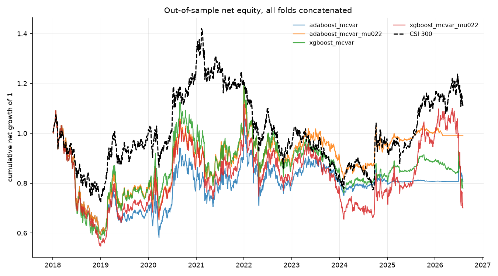
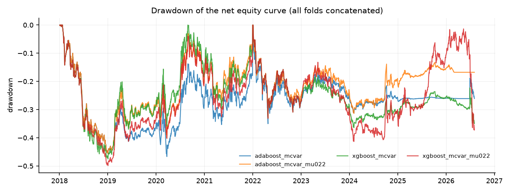
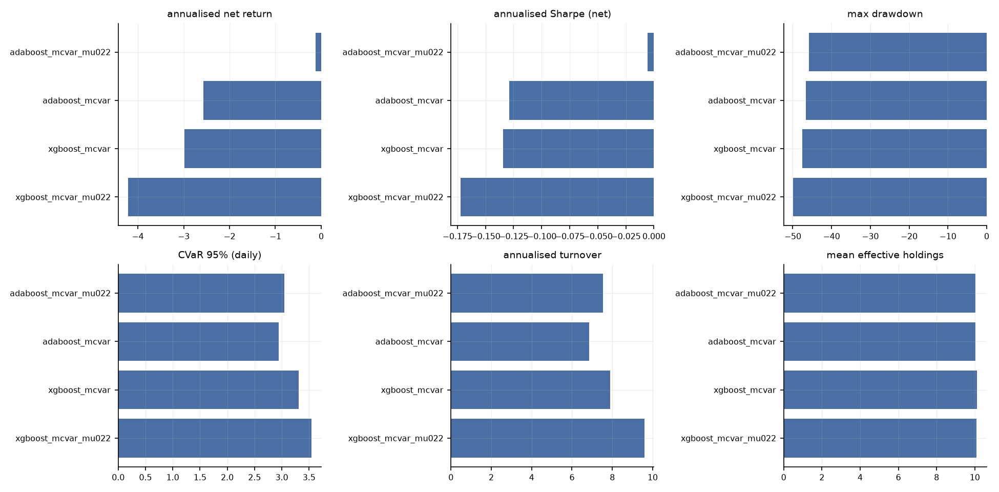
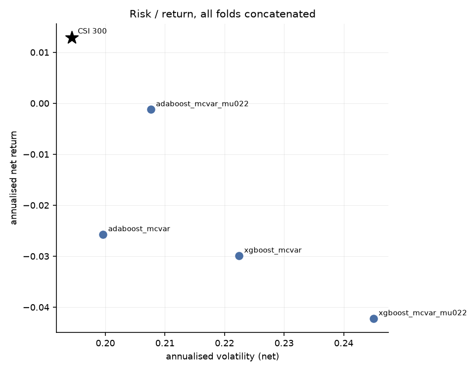
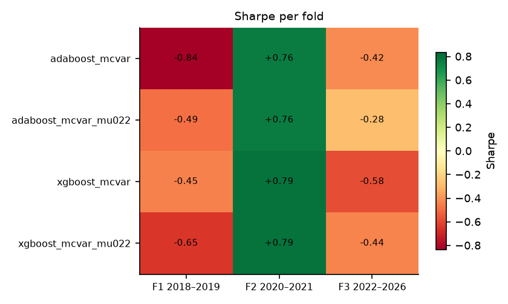

# 端到端可微 Mean-CVaR 投资组合学习 — 实验结果报告

- 运行目录：`csi300_tree_baselines_20260912`
- 运行耗时：15.4 分钟，作业 3/3 成功
- 样本：沪深 300 动态成分股，测试窗口 3 折拼接，VaR/CVaR 置信水平 95%
- 成本假设：单边 15.00 bp，线性；换手率按单边（½·Σ|Δw|）统计，并按实际调仓频率年化

## 0. 折划分

| 折 | 训练起 | 训练止 | 验证起 | 验证止 | 测试起 | 测试止 |
|---|---|---|---|---|---|---|
| f1_2018_2019 | 2010-01-01 | 2016-12-31 | 2017-01-01 | 2017-12-31 | 2018-01-01 | 2019-12-31 |
| f2_2020_2021 | 2010-01-01 | 2018-12-31 | 2019-01-01 | 2019-12-31 | 2020-01-01 | 2021-12-31 |
| f3_2022_2026 | 2010-01-01 | 2020-12-31 | 2021-01-01 | 2021-12-31 | 2022-01-01 | 2026-12-31 |

## 1. 主结果（所有折的样本外日收益拼接后重算）

| 实验 | 类别 | 年化净收益 | 年化波动 | Sharpe | 最大回撤 | CVaR95(日) | 年化换手 | 有效持仓 | 成本拖累 |
|---|---|---|---|---|---|---|---|---|---|
| adaboost_mcvar_mu022 | tree_baseline | -0.12% | 20.76% | -0.01 | -45.78% | 3.05% | 7.55 | 10.03 | 2.29% |
| adaboost_mcvar | tree_baseline | -2.57% | 19.96% | -0.13 | -46.67% | 2.94% | 6.86 | 10.04 | 2.03% |
| xgboost_mcvar | tree_baseline | -2.99% | 22.24% | -0.13 | -47.52% | 3.31% | 7.90 | 10.11 | 2.33% |
| xgboost_mcvar_mu022 | tree_baseline | -4.22% | 24.50% | -0.17 | -49.87% | 3.55% | 9.58 | 10.08 | 2.80% |

### 1.2 持仓数量与集中度（Plan §6 要求项）

逐次调仓统计后取均值；HHI = Σw²，Top-5 与最大权重为占组合比例。

| 实验 | 类别 | 持仓数(>1e-3) | 有效持仓 1/Σw² | HHI Σw² | 前5大权重 | 最大单一权重 |
|---|---|---|---|---|---|---|
| adaboost_mcvar_mu022 | tree_baseline | 10.53 | 10.03 | 0.10 | 51.55% | 10.69% |
| adaboost_mcvar | tree_baseline | 10.73 | 10.04 | 0.10 | 52.19% | 10.86% |
| xgboost_mcvar | tree_baseline | 10.66 | 10.11 | 0.10 | 51.32% | 10.51% |
| xgboost_mcvar_mu022 | tree_baseline | 10.49 | 10.08 | 0.10 | 51.11% | 11.03% |

## 2. 分折结果

### 2.1 Sharpe

| 实验 | 折 | Sharpe | 年化净收益 | 最大回撤 | CVaR95(日) |
|---|---|---|---|---|---|
| adaboost_mcvar | f1_2018_2019 | -0.84 | -16.13% | -45.77% | 2.86% |
| adaboost_mcvar | f2_2020_2021 | 0.76 | 22.56% | -25.01% | 4.01% |
| adaboost_mcvar | f3_2022_2026 | -0.42 | -5.90% | -30.22% | 2.08% |
| adaboost_mcvar_mu022 | f1_2018_2019 | -0.49 | -10.87% | -45.78% | 3.12% |
| adaboost_mcvar_mu022 | f2_2020_2021 | 0.76 | 22.56% | -25.01% | 4.01% |
| adaboost_mcvar_mu022 | f3_2022_2026 | -0.28 | -4.00% | -30.22% | 2.19% |
| xgboost_mcvar | f1_2018_2019 | -0.45 | -11.28% | -47.52% | 3.47% |
| xgboost_mcvar | f2_2020_2021 | 0.79 | 23.74% | -29.71% | 4.22% |
| xgboost_mcvar | f3_2022_2026 | -0.58 | -9.31% | -34.26% | 2.45% |
| xgboost_mcvar_mu022 | f1_2018_2019 | -0.65 | -14.45% | -49.87% | 3.12% |
| xgboost_mcvar_mu022 | f2_2020_2021 | 0.79 | 23.77% | -29.71% | 4.22% |
| xgboost_mcvar_mu022 | f3_2022_2026 | -0.44 | -10.05% | -39.33% | 3.40% |

## 3. 选择层诊断

未找到 `report/selection_diagnostics.csv`。先运行

```bash
python scripts/04_selection_diagnostics.py --run csi300_tree_baselines_20260912
```
后重新生成本报告，即可看到选择层（支撑集 / 仓位上限）的逐期诊断。

## 4. 结论

1. **整体排序**：在全部 3 折测试窗口拼接后的样本上，夏普比率最高的是 `adaboost_mcvar_mu022`（Sharpe -0.01，年化净收益 -0.12%，最大回撤 -45.78%）。基准（等权 1/N）的年化净收益为 n/a，传统历史情景 Mean-CVaR 为 n/a。
7. **跨折稳定性**：没有任何实验在全部 3 折上都取得正夏普；正夏普折数最多的是 `adaboost_mcvar_mu022`（1/3 折，最差 -0.49 / 最好 +0.76）。所有策略在不同年份区间上都有明显波动，单折结论不足以支撑泛化性判断。
8. **解读与局限**：结论受限于（a）单一指数（沪深 300 动态成分股）与单一成本假设（单边 15 bp 线性成本，未建模冲击成本与涨跌停延迟成交）；（b）测试窗口只有 3 折、共约 8 年，统计功效有限；（c）场景生成是高斯参数化模型，CVaR 只对模型隐含分布稳健；（d）深度网络的随机性使同一配置重复训练仍会有数个百分点差异，报告中的差异若小于该量级不应视为真实效应；（e）资产槽位数 `n_max` 由每折的可投资域决定（f1/f2/f3 = 154/155/165），它通过 `Dropout` 的随机数消耗量影响训练轨迹，因此**跨折的绝对值不可直接横向比较**（仓库内同一折的所有实验共用同一个 `n_max`，折内比较仍然成立）；（f）选择层的稀疏不等于组合稀疏——单票 10% 上限会把权重摊到更多票上，有效持仓应看回测输出的 `eff_holdings`（`full` 为 n/a 只），而不是 π 的支撑集大小。

## 5. 图表











## 6. 复现

```bash
python scripts/01_prepare_data.py --validate
python scripts/02_run_experiments.py --config results/csi300_tree_baselines_20260912/config.yaml --workers 4
python scripts/04_selection_diagnostics.py --run results/csi300_tree_baselines_20260912
python scripts/03_report.py --run results/csi300_tree_baselines_20260912
```

> 每次运行都会把**解析后的完整配置**复制到运行目录的 `config.yaml`，因此上面第二条命令对基线网格（`configs/csi300.yaml`）、固定分数规则网格（`configs/csi300_score_rule.yaml`）和全样本扩展网格（`configs/csi300_full_universe.yaml`）都成立。
