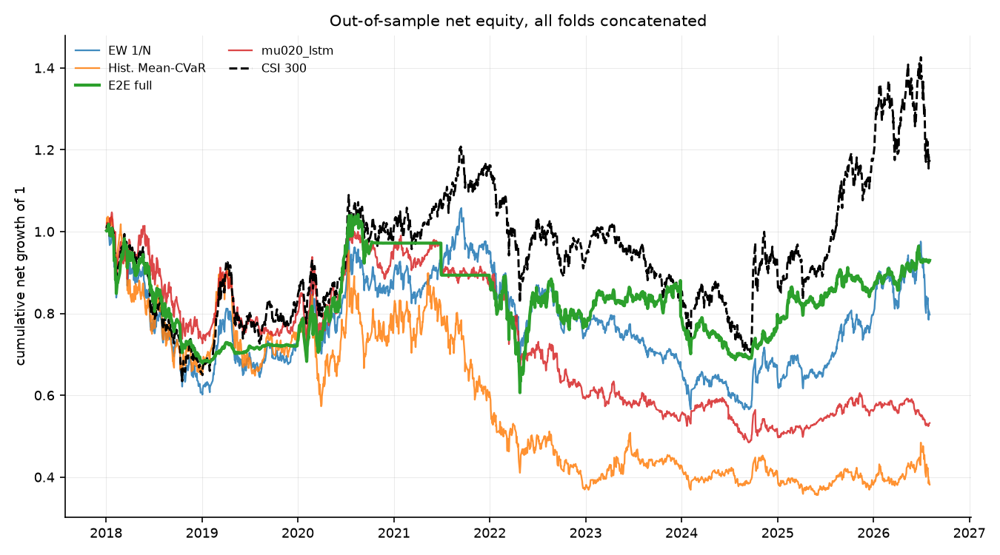
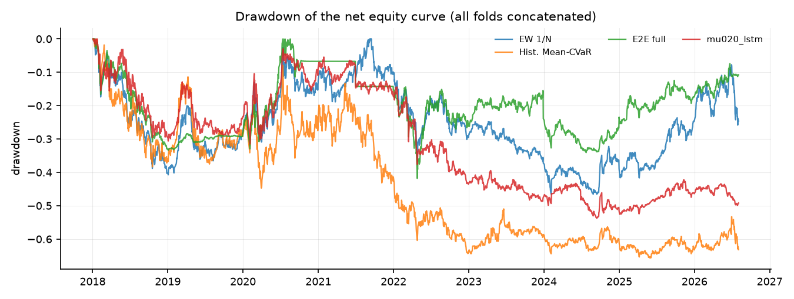
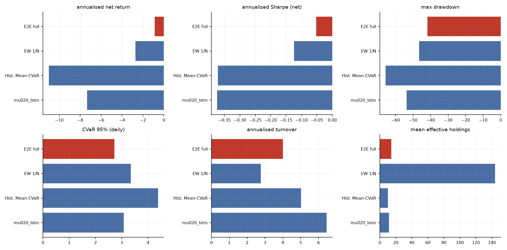
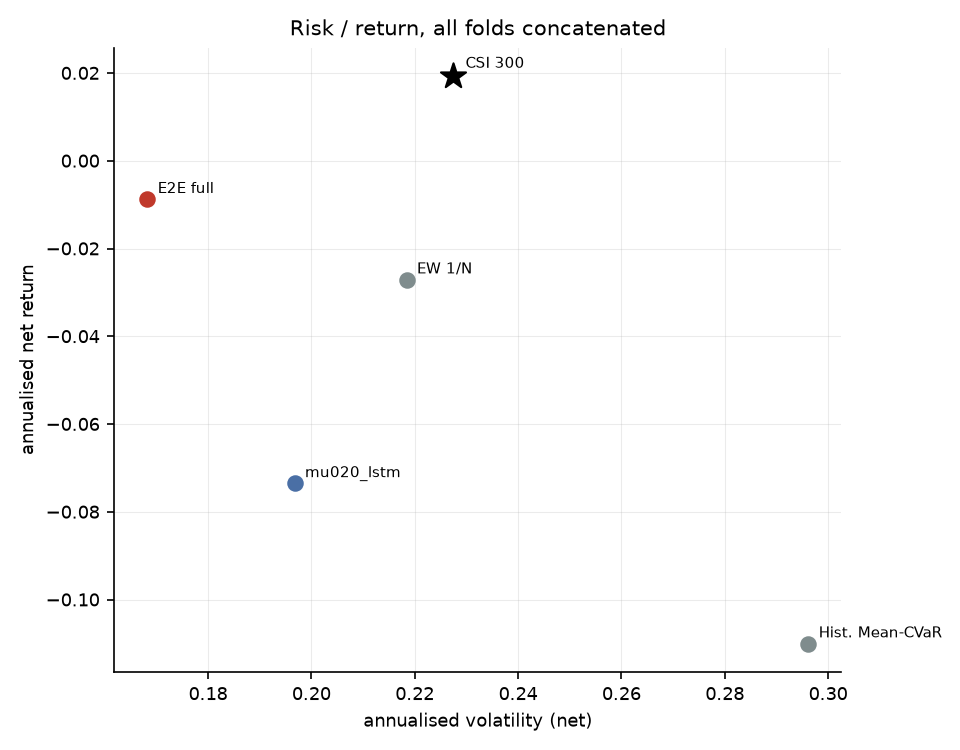
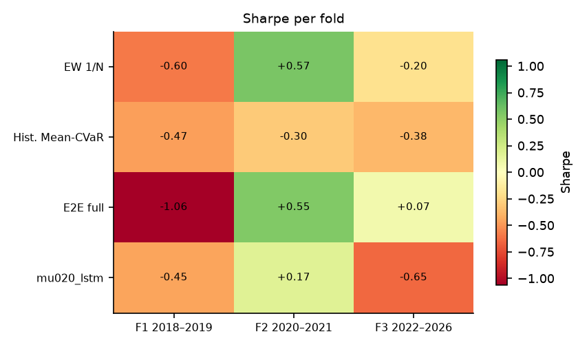
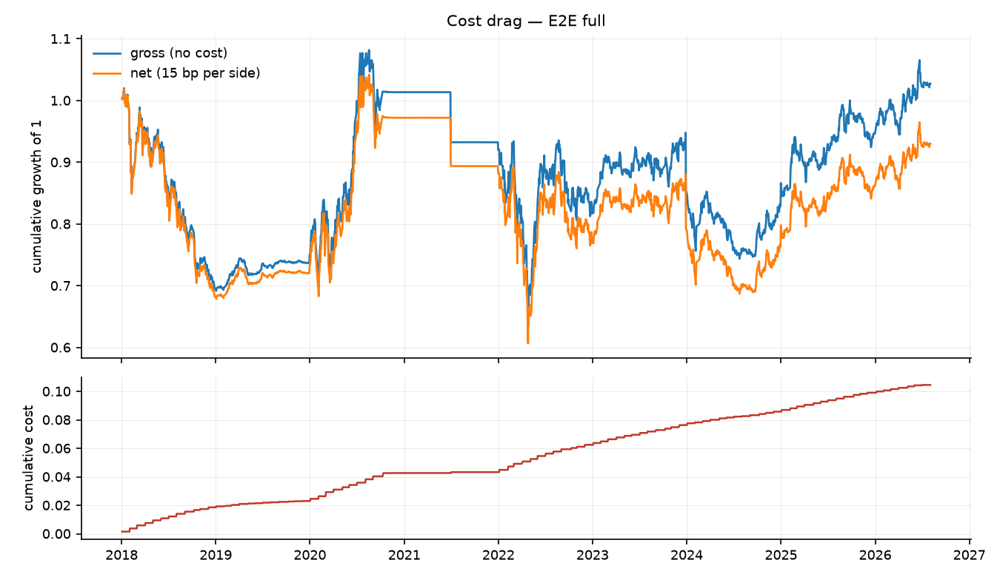
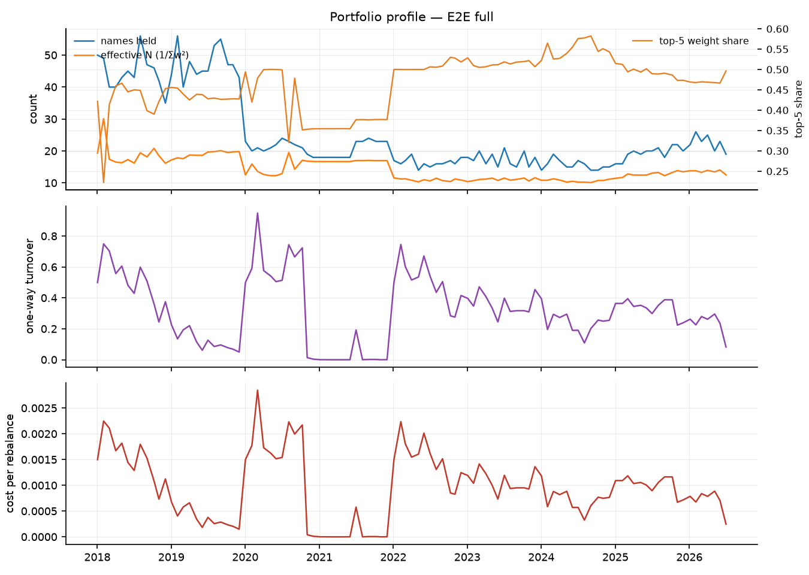

# 端到端可微 Mean-CVaR 投资组合学习 — 实验结果报告

- 运行目录：`csi500_reference_20260912`
- 运行耗时：30.5 分钟，作业 4/4 成功
- 样本：沪深 300 动态成分股，测试窗口 3 折拼接，VaR/CVaR 置信水平 95%
- 成本假设：单边 15.00 bp，线性；换手率按单边（½·Σ|Δw|）统计，并按实际调仓频率年化

## 0. 折划分

| 折 | 训练起 | 训练止 | 验证起 | 验证止 | 测试起 | 测试止 |
|---|---|---|---|---|---|---|
| f1_2018_2019 | 2010-01-01 | 2016-12-31 | 2017-01-01 | 2017-12-31 | 2018-01-01 | 2019-12-31 |
| f2_2020_2021 | 2010-01-01 | 2018-12-31 | 2019-01-01 | 2019-12-31 | 2020-01-01 | 2021-12-31 |
| f3_2022_2026 | 2010-01-01 | 2020-12-31 | 2021-01-01 | 2021-12-31 | 2022-01-01 | 2026-12-31 |

## 1. 主结果（所有折的样本外日收益拼接后重算）

| 实验 | 类别 | 年化净收益 | 年化波动 | Sharpe | 最大回撤 | CVaR95(日) | 年化换手 | 有效持仓 | 成本拖累 |
|---|---|---|---|---|---|---|---|---|---|
| full | e2e | -0.88% | 16.82% | -0.05 | -41.79% | 2.72% | 4.00 | 14.30 | 1.20% |
| ew | baseline | -2.71% | 21.84% | -0.12 | -46.53% | 3.34% | 2.76 | 143.82 | 0.81% |
| meancvar_hist | baseline | -11.00% | 29.62% | -0.37 | -65.63% | 4.39% | 5.02 | 10.02 | 1.35% |
| mu020_lstm | e2e | -7.35% | 19.67% | -0.37 | -53.72% | 3.08% | 6.45 | 11.51 | 1.81% |

### 1.2 持仓数量与集中度（Plan §6 要求项）

逐次调仓统计后取均值；HHI = Σw²，Top-5 与最大权重为占组合比例。

| 实验 | 类别 | 持仓数(>1e-3) | 有效持仓 1/Σw² | HHI Σw² | 前5大权重 | 最大单一权重 |
|---|---|---|---|---|---|---|
| full | e2e | 25.14 | 14.30 | 0.07 | 46.56% | 10.92% |
| ew | baseline | 148.62 | 143.82 | 0.01 | 5.11% | 1.10% |
| meancvar_hist | baseline | 11.68 | 10.02 | 0.10 | 54.21% | 11.72% |
| mu020_lstm | e2e | 18.17 | 11.51 | 0.09 | 51.09% | 10.54% |

## 2. 分折结果

### 2.1 Sharpe

| 实验 | 折 | Sharpe | 年化净收益 | 最大回撤 | CVaR95(日) |
|---|---|---|---|---|---|
| ew | f1_2018_2019 | -0.60 | -14.31% | -40.73% | 3.65% |
| ew | f2_2020_2021 | 0.57 | 13.64% | -20.59% | 3.66% |
| ew | f3_2022_2026 | -0.20 | -3.90% | -39.12% | 3.04% |
| full | f1_2018_2019 | -1.06 | -14.77% | -33.35% | 2.39% |
| full | f2_2020_2021 | 0.55 | 9.98% | -15.36% | 3.13% |
| full | f3_2022_2026 | 0.07 | 1.20% | -32.00% | 2.66% |
| meancvar_hist | f1_2018_2019 | -0.47 | -14.29% | -38.33% | 4.25% |
| meancvar_hist | f2_2020_2021 | -0.30 | -11.35% | -38.46% | 5.64% |
| meancvar_hist | f3_2022_2026 | -0.38 | -9.36% | -36.97% | 3.48% |
| mu020_lstm | f1_2018_2019 | -0.45 | -10.63% | -30.60% | 3.41% |
| mu020_lstm | f2_2020_2021 | 0.17 | 3.75% | -22.12% | 3.49% |
| mu020_lstm | f3_2022_2026 | -0.65 | -10.43% | -45.95% | 2.65% |

## 3. 选择层诊断

未找到 `report/selection_diagnostics.csv`。先运行

```bash
python scripts/04_selection_diagnostics.py --run csi500_reference_20260912
```
后重新生成本报告，即可看到选择层（支撑集 / 仓位上限）的逐期诊断。

## 4. 结论

1. **整体排序**：在全部 3 折测试窗口拼接后的样本上，夏普比率最高的是 `full`（Sharpe -0.05，年化净收益 -0.88%，最大回撤 -41.79%）。基准（等权 1/N）的年化净收益为 -2.71%，传统历史情景 Mean-CVaR 为 -11.00%。
5. **相对等权基线的真实超额**：`full` 年化净收益 -0.88%，等权 -2.71%；信息比率 -0.23，alpha -1.62%，beta 0.48。最大回撤从 -46.53% 收窄到 -41.79%。
6. **风险与成本**：`full` 的日 CVaR(95%) 为 2.72%，年化波动 16.82%，平均持仓 25.1 只、有效持仓 14.3 只，年化单边换手 4.00，成本拖累（毛收益−净收益）1.20%。
7. **跨折稳定性**：没有任何实验在全部 3 折上都取得正夏普；正夏普折数最多的是 `full`（2/3 折，最差 -1.06 / 最好 +0.55）。所有策略在不同年份区间上都有明显波动，单折结论不足以支撑泛化性判断。
8. **解读与局限**：结论受限于（a）单一指数（沪深 300 动态成分股）与单一成本假设（单边 15 bp 线性成本，未建模冲击成本与涨跌停延迟成交）；（b）测试窗口只有 3 折、共约 8 年，统计功效有限；（c）场景生成是高斯参数化模型，CVaR 只对模型隐含分布稳健；（d）深度网络的随机性使同一配置重复训练仍会有数个百分点差异，报告中的差异若小于该量级不应视为真实效应；（e）资产槽位数 `n_max` 由每折的可投资域决定（f1/f2/f3 = 154/155/165），它通过 `Dropout` 的随机数消耗量影响训练轨迹，因此**跨折的绝对值不可直接横向比较**（仓库内同一折的所有实验共用同一个 `n_max`，折内比较仍然成立）；（f）选择层的稀疏不等于组合稀疏——单票 10% 上限会把权重摊到更多票上，有效持仓应看回测输出的 `eff_holdings`（`full` 为 14.3 只），而不是 π 的支撑集大小。

## 5. 图表
















## 6. 复现

```bash
python scripts/01_prepare_data.py --validate
python scripts/02_run_experiments.py --config results/csi500_reference_20260912/config.yaml --workers 4
python scripts/04_selection_diagnostics.py --run results/csi500_reference_20260912
python scripts/03_report.py --run results/csi500_reference_20260912
```

> 每次运行都会把**解析后的完整配置**复制到运行目录的 `config.yaml`，因此上面第二条命令对基线网格（`configs/csi300.yaml`）、固定分数规则网格（`configs/csi300_score_rule.yaml`）和全样本扩展网格（`configs/csi300_full_universe.yaml`）都成立。
