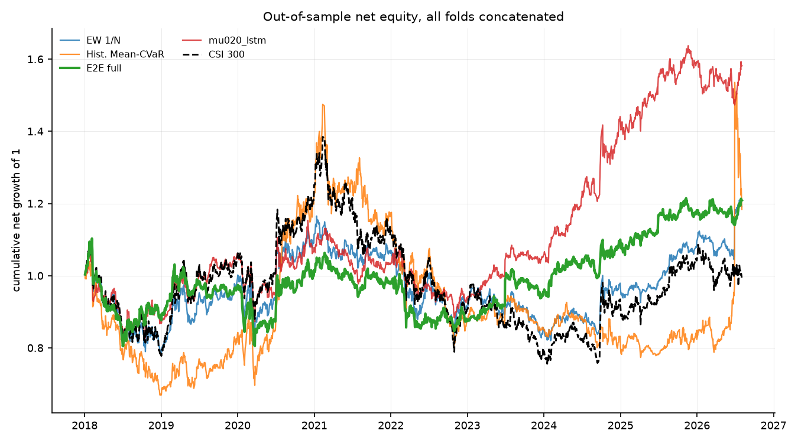
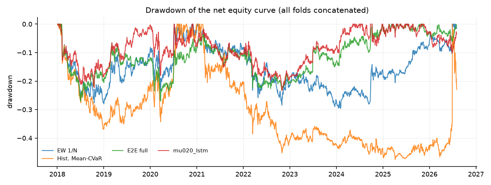
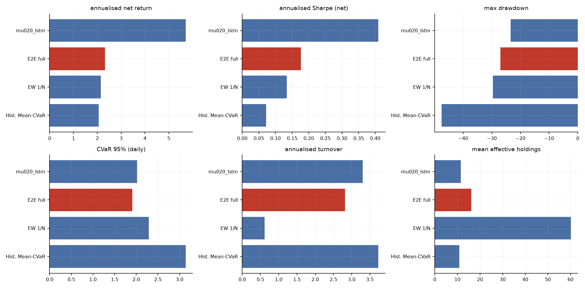
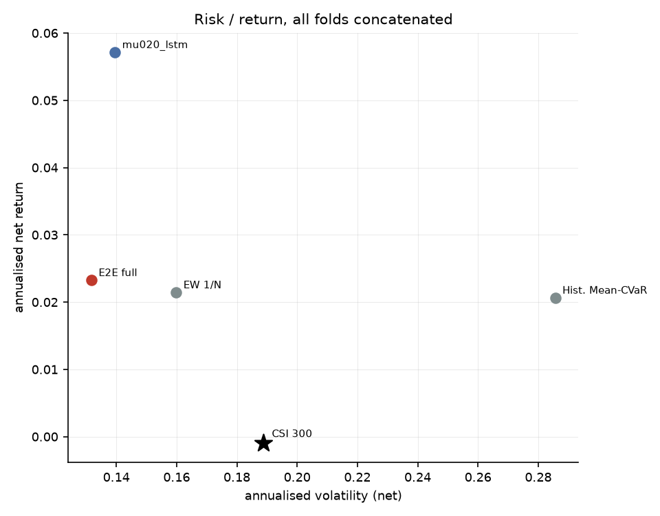
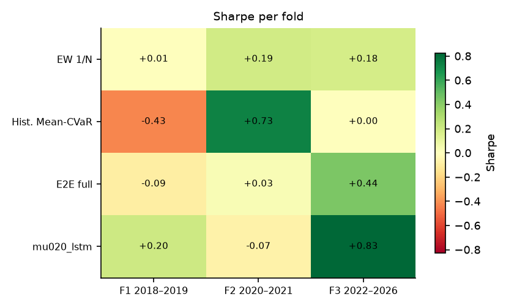
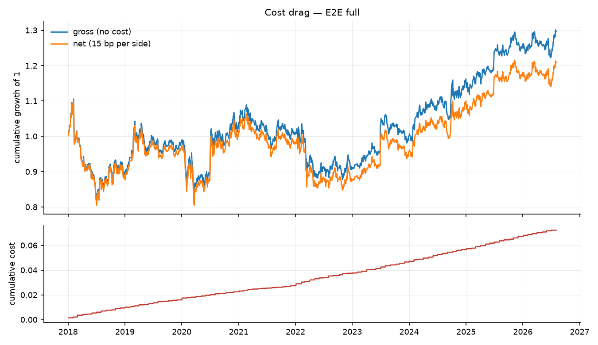
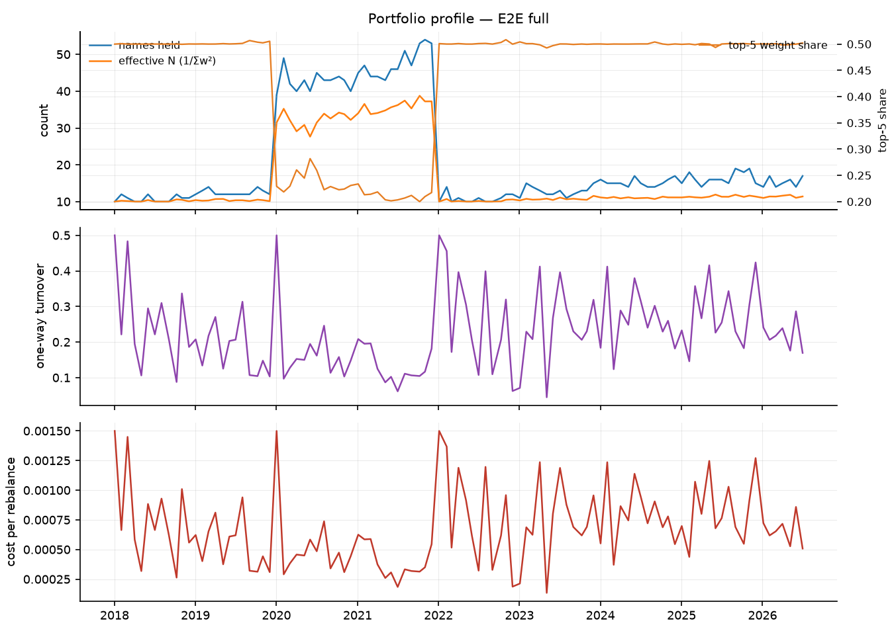

# 端到端可微 Mean-CVaR 投资组合学习 — 实验结果报告

- 运行目录：`sse50_reference_20260912`
- 运行耗时：6.9 分钟，作业 4/4 成功
- 样本：沪深 300 动态成分股，测试窗口 3 折拼接，VaR/CVaR 置信水平 95%
- 成本假设：单边 15.00 bp，线性；换手率按单边（½·Σ|Δw|）统计，并按实际调仓频率年化

## 0. 折划分

| 折 | 训练起 | 训练止 | 验证起 | 验证止 | 测试起 | 测试止 |
|---|---|---|---|---|---|---|
| f1_2018_2019 | 2010-01-01 | 2016-12-31 | 2017-01-01 | 2017-12-31 | 2018-01-01 | 2019-12-31 |
| f2_2020_2021 | 2010-01-01 | 2018-12-31 | 2019-01-01 | 2019-12-31 | 2020-01-01 | 2021-12-31 |
| f3_2022_2026 | 2010-01-01 | 2020-12-31 | 2021-01-01 | 2021-12-31 | 2022-01-01 | 2026-12-31 |

## 1. 主结果（所有折的样本外日收益拼接后重算）

| 实验 | 类别 | 年化净收益 | 年化波动 | Sharpe | 最大回撤 | CVaR95(日) | 年化换手 | 有效持仓 | 成本拖累 |
|---|---|---|---|---|---|---|---|---|---|
| mu020_lstm | e2e | 5.71% | 13.96% | 0.41 | -23.41% | 2.02% | 3.30 | 11.45 | 1.05% |
| full | e2e | 2.32% | 13.17% | 0.18 | -27.04% | 1.91% | 2.82 | 16.14 | 0.87% |
| ew | baseline | 2.14% | 15.99% | 0.13 | -29.63% | 2.29% | 0.61 | 60.21 | 0.19% |
| meancvar_hist | baseline | 2.06% | 28.57% | 0.07 | -47.54% | 3.14% | 3.73 | 10.79 | 1.15% |

### 1.2 持仓数量与集中度（Plan §6 要求项）

逐次调仓统计后取均值；HHI = Σw²，Top-5 与最大权重为占组合比例。

| 实验 | 类别 | 持仓数(>1e-3) | 有效持仓 1/Σw² | HHI Σw² | 前5大权重 | 最大单一权重 |
|---|---|---|---|---|---|---|
| mu020_lstm | e2e | 16.97 | 11.45 | 0.09 | 50.04% | 10.10% |
| full | e2e | 20.73 | 16.14 | 0.08 | 43.61% | 8.93% |
| ew | baseline | 60.83 | 60.21 | 0.02 | 10.06% | 2.19% |
| meancvar_hist | baseline | 13.81 | 10.79 | 0.09 | 50.95% | 10.55% |

## 2. 分折结果

### 2.1 Sharpe

| 实验 | 折 | Sharpe | 年化净收益 | 最大回撤 | CVaR95(日) |
|---|---|---|---|---|---|
| ew | f1_2018_2019 | 0.01 | 0.11% | -27.97% | 2.64% |
| ew | f2_2020_2021 | 0.19 | 3.42% | -16.29% | 2.62% |
| ew | f3_2022_2026 | 0.18 | 2.49% | -23.02% | 1.87% |
| full | f1_2018_2019 | -0.09 | -1.33% | -27.04% | 2.18% |
| full | f2_2020_2021 | 0.03 | 0.40% | -17.27% | 2.30% |
| full | f3_2022_2026 | 0.44 | 4.84% | -15.72% | 1.54% |
| meancvar_hist | f1_2018_2019 | -0.43 | -8.46% | -36.87% | 3.02% |
| meancvar_hist | f2_2020_2021 | 0.73 | 18.82% | -24.67% | 3.88% |
| meancvar_hist | f3_2022_2026 | 0.00 | 0.16% | -32.81% | 2.79% |
| mu020_lstm | f1_2018_2019 | 0.20 | 3.01% | -22.30% | 2.19% |
| mu020_lstm | f2_2020_2021 | -0.07 | -1.17% | -17.58% | 2.35% |
| mu020_lstm | f3_2022_2026 | 0.83 | 10.13% | -18.47% | 1.76% |

## 3. 选择层诊断

未找到 `report/selection_diagnostics.csv`。先运行

```bash
python scripts/04_selection_diagnostics.py --run sse50_reference_20260912
```
后重新生成本报告，即可看到选择层（支撑集 / 仓位上限）的逐期诊断。

## 4. 结论

1. **整体排序**：在全部 3 折测试窗口拼接后的样本上，夏普比率最高的是 `mu020_lstm`（Sharpe 0.41，年化净收益 5.71%，最大回撤 -23.41%）。基准（等权 1/N）的年化净收益为 2.14%，传统历史情景 Mean-CVaR 为 2.06%。
5. **相对等权基线的真实超额**：`full` 年化净收益 2.32%，等权 2.14%；信息比率 0.12，alpha 2.24%，beta 0.55。最大回撤从 -29.63% 收窄到 -27.04%。
6. **风险与成本**：`full` 的日 CVaR(95%) 为 1.91%，年化波动 13.17%，平均持仓 20.7 只、有效持仓 16.1 只，年化单边换手 2.82，成本拖累（毛收益−净收益）0.87%。
7. **跨折稳定性**：只有 `ew` 在全部 3 折上夏普为正；正夏普折数最多的是 `ew`（3/3 折，最差 +0.01 / 最好 +0.19）。所有策略在不同年份区间上都有明显波动，单折结论不足以支撑泛化性判断。
8. **解读与局限**：结论受限于（a）单一指数（沪深 300 动态成分股）与单一成本假设（单边 15 bp 线性成本，未建模冲击成本与涨跌停延迟成交）；（b）测试窗口只有 3 折、共约 8 年，统计功效有限；（c）场景生成是高斯参数化模型，CVaR 只对模型隐含分布稳健；（d）深度网络的随机性使同一配置重复训练仍会有数个百分点差异，报告中的差异若小于该量级不应视为真实效应；（e）资产槽位数 `n_max` 由每折的可投资域决定（f1/f2/f3 = 154/155/165），它通过 `Dropout` 的随机数消耗量影响训练轨迹，因此**跨折的绝对值不可直接横向比较**（仓库内同一折的所有实验共用同一个 `n_max`，折内比较仍然成立）；（f）选择层的稀疏不等于组合稀疏——单票 10% 上限会把权重摊到更多票上，有效持仓应看回测输出的 `eff_holdings`（`full` 为 16.1 只），而不是 π 的支撑集大小。

## 5. 图表
















## 6. 复现

```bash
python scripts/01_prepare_data.py --validate
python scripts/02_run_experiments.py --config results/sse50_reference_20260912/config.yaml --workers 4
python scripts/04_selection_diagnostics.py --run results/sse50_reference_20260912
python scripts/03_report.py --run results/sse50_reference_20260912
```

> 每次运行都会把**解析后的完整配置**复制到运行目录的 `config.yaml`，因此上面第二条命令对基线网格（`configs/csi300.yaml`）、固定分数规则网格（`configs/csi300_score_rule.yaml`）和全样本扩展网格（`configs/csi300_full_universe.yaml`）都成立。
